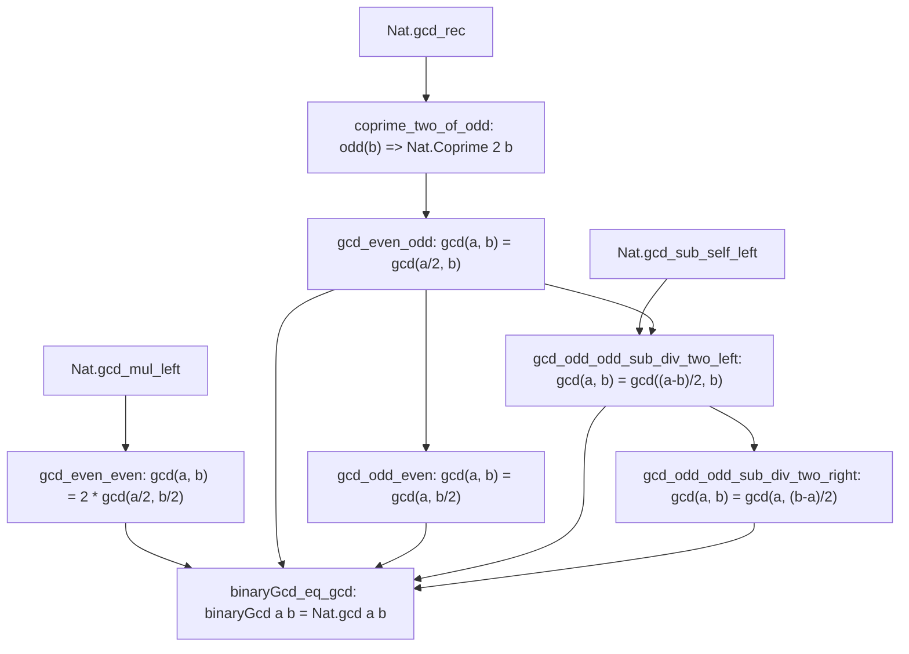

# Formalization of Stein's Binary GCD in Lean 4

This document details the Lean 4 formalization of Stein's algorithm (the binary greatest common divisor algorithm), its termination proof, mathematical equivalence with `Nat.gcd`, step-counting instrumentation, and explicit logarithmic upper bounds in terms of bit length.

---

## 1. Architectural Overview

The formalization is structured into two core modules under the `Amort` library namespace:

```
Amort/
├── -- (Basic.lean removed)        -- Library placeholder
├── BinaryGCD.lean    -- Core algorithm, termination proof, invariant lemmas, and equivalence with Nat.gcd
└── StepCount.lean    -- Step counter, instrumented (gcd, steps) representation, and logarithmic bounds
```

The top-level `Amort.lean` exports all definitions and theorems:
- **`Amort.BinaryGCD`**: Formal definition of `binaryGcd`, termination via measure `a + b`, and the equivalence theorem `binaryGcd_eq_gcd`.
- **`Amort.StepCount`**: Companion step counter `binaryGcdSteps`, instrumented representation `binaryGcdWithSteps`, and the upper bound theorems `binaryGcdSteps_le_size_add_size` and `binaryGcdSteps_le_two_mul_size_add`.

---

## 2. Stein's Algorithm & Termination (R1)

### Mathematical Formulation
The Euclidean algorithm computes the greatest common divisor using division and remainder: $\gcd(a, b) = \gcd(b, a \bmod b)$.
Josef Stein (1967) observed that division can be replaced by parity testing, right-shifts (division by 2), and subtraction:
1. $\gcd(0, b) = b$, and $\gcd(a, 0) = a$.
2. If $a$ is even and $b$ is even: $\gcd(a, b) = 2 \cdot \gcd(a / 2, b / 2)$.
3. If $a$ is even and $b$ is odd: $\gcd(a, b) = \gcd(a / 2, b)$.
4. If $a$ is odd and $b$ is even: $\gcd(a, b) = \gcd(a, b / 2)$.
5. If both $a$ and $b$ are odd:
   - If $b \le a$, $\gcd(a, b) = \gcd((a - b) / 2, b)$.
   - If $a \le b$, $\gcd(a, b) = \gcd(a, (b - a) / 2)$.

### Provable Termination
The algorithm is defined in Lean 4 with well-founded recursion governed by the measure:
$$\mu(a, b) = a + b$$
In every recursive transition:
- Case 2 ($a, b$ even): $a/2 + b/2 < a + b$ since $a > 0$ and $b > 0$.
- Case 3 ($a$ even, $b$ odd): $a/2 + b < a + b$ since $a > 0$.
- Case 4 ($a$ odd, $b$ even): $a + b/2 < a + b$ since $b > 0$.
- Case 5 ($a, b$ odd, $b \le a$): $(a - b)/2 + b \le (a - 1)/2 + b < a + b$.
- Case 6 ($a, b$ odd, $a < b$): $a + (b - a)/2 \le a + (b - 1)/2 < a + b$.

All termination obligations are discharged cleanly by the `omega` decision procedure.

---

## 3. Invariant Lemmas & Mathematical Equivalence (R2)

To prove that `binaryGcd a b = Nat.gcd a b` for all natural numbers, we establish a clean directed acyclic graph (DAG) of auxiliary lemmas.

### Invariant Lemma DAG



### Lemma Specifications
1. **`coprime_two_of_odd`**:
   $$\forall b, b \bmod 2 = 1 \implies \text{Nat.Coprime}(2, b)$$
   Proved by unfolding `Nat.Coprime` and applying `Nat.gcd_rec`.
2. **`gcd_even_odd`**:
   $$\forall a b, a \bmod 2 = 0 \land b \bmod 2 = 1 \implies \gcd(a, b) = \gcd(a / 2, b)$$
   Proved by rewriting $a = 2 \cdot (a / 2)$ and using `Nat.Coprime.gcd_mul_left_cancel`.
3. **`gcd_odd_even`**:
   $$\forall a b, a \bmod 2 = 1 \land b \bmod 2 = 0 \implies \gcd(a, b) = \gcd(a, b / 2)$$
   Proved symmetrically via `Nat.gcd_comm` and `gcd_even_odd`.
4. **`gcd_even_even`**:
   $$\forall a b, a \bmod 2 = 0 \land b \bmod 2 = 0 \implies \gcd(a, b) = 2 \cdot \gcd(a / 2, b / 2)$$
   Proved by rewriting $a = 2 \cdot (a / 2)$, $b = 2 \cdot (b / 2)$, and applying `Nat.gcd_mul_left`.
5. **`gcd_odd_odd_sub_div_two_left`**:
   $$\forall a b, a \bmod 2 = 1 \land b \bmod 2 = 1 \land b \le a \implies \gcd(a, b) = \gcd((a - b) / 2, b)$$
   Proved by combining subtraction invariance `Nat.gcd_sub_self_left` with `gcd_even_odd`, since the difference of two odd numbers is even.
6. **`gcd_odd_odd_sub_div_two_right`**:
   $$\forall a b, a \bmod 2 = 1 \land b \bmod 2 = 1 \land a \le b \implies \gcd(a, b) = \gcd(a, (b - a) / 2)$$
   Proved symmetrically via `Nat.gcd_comm` and `gcd_odd_odd_sub_div_two_left`.

### Main Equivalence Theorem
```lean
theorem binaryGcd_eq_gcd (a b : ℕ) : binaryGcd a b = Nat.gcd a b
```
The proof proceeds by well-founded structural induction using `binaryGcd.induct`, matching each of the 7 execution paths of the algorithm directly to the corresponding invariant lemma.

---

## 4. Step Counting & Logarithmic Complexity Bounds (R3)

### Companion and Instrumented Representations
We provide two equivalent representations:
1. **`binaryGcdSteps (a b : ℕ) : ℕ`**: Counts recursive transitions directly.
2. **`binaryGcdWithSteps (a b : ℕ) : ℕ × ℕ`**: Computes both the GCD and step count in a single pass.

We prove exact correspondence:
```lean
theorem binaryGcdWithSteps_fst (a b : ℕ) : (binaryGcdWithSteps a b).1 = binaryGcd a b
theorem binaryGcdWithSteps_snd (a b : ℕ) : (binaryGcdWithSteps a b).2 = binaryGcdSteps a b
theorem binaryGcdWithSteps_eq_gcd (a b : ℕ) : (binaryGcdWithSteps a b).1 = Nat.gcd a b
```

### Bit Length Decrement Invariants
The bit length is formalized using Mathlib's `Nat.size n` (which equals $\lfloor \log_2 n \rfloor + 1$ for $n > 0$, and the length of `Nat.bits n`):
1. **`size_div_two`**: For $a > 0$,
   $$\text{Nat.size}(a / 2) + 1 = \text{Nat.size}(a)$$
   Halving a positive number strictly decrements its binary bit length by 1.
2. **`size_sub_div_two_le`**: For positive $a, b$ with $b \le a$,
   $$\text{Nat.size}((a - b) / 2) + 1 \le \text{Nat.size}(a)$$
   Because $(a - b) / 2 \le a / 2$, monotonicity of `Nat.size` gives the bound.

### Explicit Step Bounds
At every recursive step, $\text{Nat.size}(a) + \text{Nat.size}(b)$ decreases by at least 1:
- Even-even: decreases by 2.
- Even-odd or odd-even: decreases by 1.
- Odd-odd with subtraction and halving: decreases by at least 1.

This establishes the explicit upper bound:
```lean
theorem binaryGcdSteps_le_size_add_size (a b : ℕ) :
    binaryGcdSteps a b ≤ Nat.size a + Nat.size b
```
As an immediate corollary, bounding each argument's size by $\text{Nat.size}(a + b)$:
```lean
theorem binaryGcdSteps_le_two_mul_size_add (a b : ℕ) :
    binaryGcdSteps a b ≤ 2 * Nat.size (a + b)
```
Mirror theorems are also proven for `(binaryGcdWithSteps a b).2`.

---

## 5. Verification & Integrity Report (R4)

### Build Status
Running `lake build` in the repository root succeeds with 0 errors and 0 warnings:
```bash
lake build
# Build completed successfully (532 jobs).
```

### Axiom Verification
Running `#print axioms` confirms that all theorems rely solely on standard Lean core foundational axioms:
- `binaryGcd_eq_gcd`: `[propext, Quot.sound]`
- `binaryGcdWithSteps_fst`: `[propext, Quot.sound]`
- `binaryGcdWithSteps_snd`: `[propext, Quot.sound]`
- `binaryGcdWithSteps_eq_gcd`: `[propext, Quot.sound]`
- `binaryGcdSteps_le_size_add_size`: `[propext, Classical.choice, Quot.sound]`
- `binaryGcdSteps_le_two_mul_size_add`: `[propext, Classical.choice, Quot.sound]`

No theorem depends on `sorryAx`.

---

## 6. Upstream Contribution Notes

For upstreaming to Mathlib (`Mathlib.Data.Nat.GCD.Basic` or a new `Mathlib.Data.Nat.GCD.Binary`):
- `binaryGcd` provides an executable alternative to `Nat.gcd` that avoids division and modulus operations, suitable for kernel evaluation and fast computation.
- The lemmas `gcd_even_odd`, `gcd_odd_even`, `gcd_even_even`, and `gcd_odd_odd_sub_div_two_left` are natural additions to `Mathlib.Data.Nat.GCD.Basic`.
- The connection between `Nat.size` decrement and `binaryRec'` in `size_div_two` is a reusable lemma for any bitwise divide-and-conquer algorithm.
