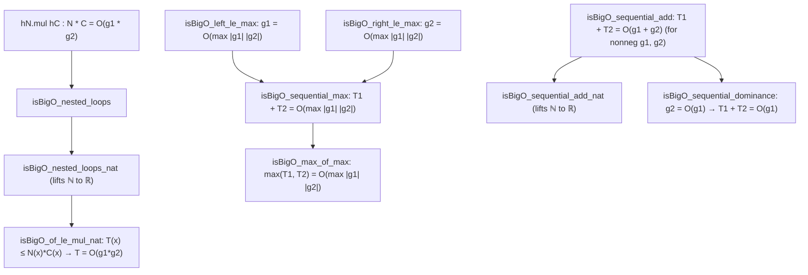

# Formalization of Compositional Complexity Algebra in Lean 4

This document details the Lean 4 formalization of compositional asymptotic complexity in [`Amort/Recurrence/Composition.lean`](Composition.lean).

---

## 1. Problem Formulation and Setup

In algorithm analysis, high-level complexity bounds are frequently composed from modular subroutines:
1. **Nested Loops (Product Composition)**:
   An outer loop executing $N(n) = O(g_1(n))$ times where iteration $i$ consumes $C(n) = O(g_2(n))$ steps incurs total work:
   $$N(n) \cdot C(n) = O(g_1(n) \cdot g_2(n))$$
2. **Sequential Phases (Sum and Maximum Composition)**:
   An algorithm executing Phase 1 ($T_1(n) = O(g_1(n))$) followed by Phase 2 ($T_2(n) = O(g_2(n))$) incurs total work:
   $$T_1(n) + T_2(n) = O(g_1(n) + g_2(n)) = O(\max(|g_1(n)|, |g_2(n)|))$$
3. **Phase Dominance**:
   If Phase 2 is asymptotically subordinate to Phase 1 ($g_2 = O(g_1)$), the total cost is governed entirely by Phase 1:
   $$T_1(n) + T_2(n) = O(g_1(n))$$

Mathlib provides `Mathlib.Analysis.Asymptotics.IsBigO`, but applying it to algorithmic step counters requires lemmas that preserve nonnegativity, handle pointwise inequality bounding, lift naturally from `ℕ` to `ℝ`, and avoid re-proving filter bounds.

---

## 2. Mathematical Architecture

The theorems in [`Amort/Recurrence/Composition.lean`](Composition.lean) build a modular algebra:

---

## 3. Key Theorems and Proof Strategies

### 3.1 Nested Loops and Pointwise Product Bounds
- **Direct Product** (`isBigO_nested_loops`):
  $$N = O(g_1) \land C = O(g_2) \implies (N \cdot C) = O(g_1 \cdot g_2)$$
  *Strategy*: Directly applies Mathlib's `Asymptotics.IsBigO.mul`.

- **Pointwise Upper Bound** (`isBigO_of_le_mul`):
  If $0 \le T(x) \le N(x) \cdot C(x)$ eventually, then $T = O(g_1 \cdot g_2)$.
  *Strategy*: Unfolds `isBigO_iff` to extract constant $c$ such that $|N(x) C(x)| \le c |g_1(x) g_2(x)|$, and uses transitivity with $T(x) \le N(x) C(x)$.

- **Natural Number Bridge** (`isBigO_nested_loops_nat` and `isBigO_of_le_mul_nat`):
  Takes $N, C, g_1, g_2, T : \alpha \to \mathbb{N}$, casts to `ℝ`, and proves:
  $$(T(x) \le N(x) \cdot C(x)) \implies ((T(x) : \mathbb{R}) = O((g_1(x) \cdot g_2(x) : \mathbb{R})))$$
  via `Nat.cast_mul` and `Nat.cast_le`.

### 3.2 Sequential Phases (Sum and Max Composition)
- **Bounding by Max** (`isBigO_left_le_max`, `isBigO_right_le_max`):
  Shows $|g_1(x)| \le \max(|g_1(x)|, |g_2(x)|)$ with constant $c = 1$.
- **Sequential Sum Bounded by Max** (`isBigO_sequential_max`):
  $$T_1 = O(g_1) \land T_2 = O(g_2) \implies T_1 + T_2 = O(\max(|g_1|, |g_2|))$$
  *Strategy*: Chains $T_1 = O(g_1) = O(\max(|g_1|, |g_2|))$ and $T_2 = O(g_2) = O(\max(|g_1|, |g_2|))$, then adds them via `IsBigO.add`.
- **Nonnegative Sum Rule** (`isBigO_sequential_add`):
  For nonnegative $g_1, g_2 \ge 0$:
  $$T_1 + T_2 = O(g_1 + g_2)$$
  *Strategy*: $g_1 \le g_1 + g_2$ and $g_2 \le g_1 + g_2$ with nonnegativity yield $g_1 = O(g_1 + g_2)$ and $g_2 = O(g_1 + g_2)$.
- **Natural Coercion Sum** (`isBigO_sequential_add_nat`):
  Instantiates the sum rule for $\mathbb{N}$-valued counters with `Nat.cast_add`.

### 3.3 Phase Dominance
- **Dominance Addition** (`isBigO_add_of_isBigO`):
  $$g_2 = O(g_1) \implies g_1 + g_2 = O(g_1)$$
  *Strategy*: Adds `isBigO_refl g_1` to $h : g_2 = O(g_1)$.
- **Sequential Phase Dominance** (`isBigO_sequential_dominance`):
  $$T_1 = O(g_1) \land T_2 = O(g_2) \land g_2 = O(g_1) \implies T_1 + T_2 = O(g_1)$$
  *Strategy*: `hT₁.add (hT₂.trans hg)`.

---

## 4. Usage in Algorithm Modules

This compositional framework directly powers the asymptotic bounds of downstream algorithms:
- **String Algorithms** ([`Amort/String/Asymptotics.lean`](../String/Asymptotics.lean)):
  - Naive String Matching: $O((n - m + 1) \cdot m) = O(n \cdot m)$ via `isBigO_of_le_mul_nat`.
  - Dynamic Programming (LCS & Edit Distance): 2D matrix fill $O((n+1)(m+1)) = O(n \cdot m)$ via `isBigO_nested_loops_nat`.
  - KMP Total Time: Preprocessing $O(m)$ + Search $O(n)$ yields $O(n + m)$ via `isBigO_sequential_add_nat`.
- **Divide and Conquer** ([`Amort/Recurrence/MasterTheorem.lean`](MasterTheorem.lean)):
  - Logarithmic expansion $n \cdot \text{Nat.size } n = O(n \log n)$ via product rule `h_refl.mul h_size`.

---

## 5. Axiomatic Verification

Inspection via `#print axioms` confirms that all theorems in `Amort.Recurrence.Composition` depend exclusively on:
- `propext`
- `Classical.choice`
- `Quot.sound`
With **0 occurrences of `sorryAx`** and 0 compiler warnings.
