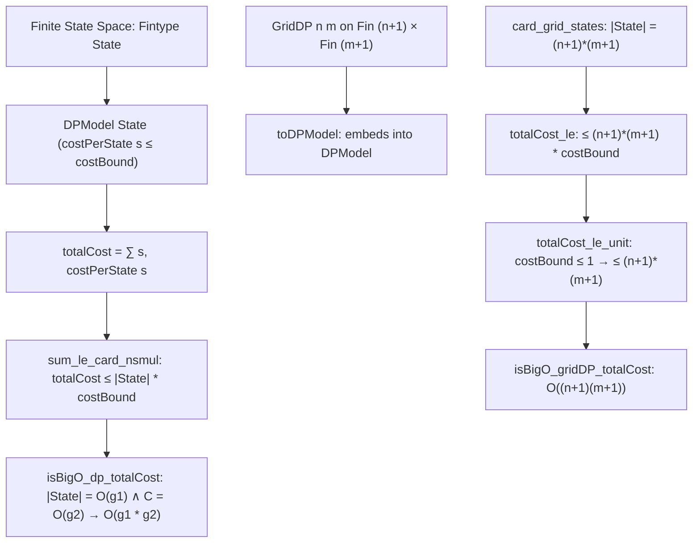

# Formalization of State-Space Dynamic Programming in Lean 4

This document details the Lean 4 formalization of the general state-space (DAG / memoization) dynamic programming complexity framework in [`Amort/Recurrence/DP.lean`](DP.lean).

---

## 1. Problem Formulation and Setup

In classical algorithm analysis, dynamic programming time complexity is typically argued by:
$$\text{Total Time} \le |S| \times \max_{s \in S} c(s)$$
where:
1. $S$ is the **finite subproblem state space** (the set of all reachable subproblems).
2. $c(s)$ is the **local work** performed at state $s$ excluding recursive calls to other subproblems (e.g. taking $\min$ or $\max$ over $k$ choices, or comparing two sequence characters).
3. Any memoized execution or topological ordering over the subproblem DAG computes each state $s \in S$ **at most once**.

### Why Not Only Bottom-Up Tables?
Constructing an explicit bottom-up nested loop or matrix fold is tedious or unnatural for many common DP paradigms:
- **Interval DP**: Requires iterating along diagonals $|j - i| = d$.
- **Tree DP**: Requires topological post-order traversals over tree structures.
- **Bitmask / Subset DP**: Requires traversing submasks or powersets.
- **Digit DP**: Involves multi-dimensional constrained state spaces.

By formalizing the state-space bound abstractly, any dynamic program can be bounded simply by specifying the `State` type, bounding its cardinality $|S|$, and bounding the local transition cost $C$.

---

## 2. Mathematical Architecture



---

## 3. Key Definitions & Theorems

### 3.1 General State-Space DP Model
```lean
structure DPModel (State : Type*) [Fintype State] where
  costPerState : State → ℕ
  costBound : ℕ
  h_cost : ∀ s : State, costPerState s ≤ costBound
```

- **Total Work** (`DPModel.totalCost`):
  $$\text{totalCost}(dp) = \sum_{s \in \text{State}} c(s)$$
- **Fundamental State Space Bound** (`DPModel.totalCost_le`):
  $$\text{totalCost}(dp) \le |\text{State}| \cdot \text{costBound}$$
  *Strategy*: Derived via `Finset.sum_le_card_nsmul` on `Finset.univ`.

### 3.2 2D Grid DP Specialization
For sequence alignment and string DPs (LCS, Edit Distance), states are pairs of prefix or suffix indices $(i, j) \in \text{Fin}(n + 1) \times \text{Fin}(m + 1)$:

```lean
structure GridDP (n m : ℕ) where
  costPerCell : Fin (n + 1) → Fin (m + 1) → ℕ
  costBound : ℕ
  h_cost : ∀ i j, costPerCell i j ≤ costBound
```

- **Cardinality** (`card_grid_states`):
  $$|\text{Fin}(n + 1) \times \text{Fin}(m + 1)| = (n + 1)(m + 1)$$
- **Total Work Bound** (`GridDP.totalCost_le`):
  $$\text{totalCost} \le (n + 1)(m + 1) \cdot \text{costBound}$$
- **Unit Transition Bound** (`GridDP.totalCost_le_unit`):
  When each state incurs at most 1 comparison/branch ($\text{costBound} \le 1$):
  $$\text{totalCost} \le (n + 1)(m + 1)$$

---

## 4. Asymptotic Complexity Bridges

1. **General State-Space Product Rule** (`isBigO_dp_totalCost`):
   If $|\text{State}(a)| = O(g_1(a))$ and $\text{costBound}(a) = O(g_2(a))$, then:
   $$\text{totalCost}(dp(a)) = O(g_1(a) \cdot g_2(a))$$
   directly lifting via `Amort.Recurrence.Composition.isBigO_of_le_mul_nat`.

2. **2D Grid Asymptotics** (`isBigO_gridDP_totalCost`):
   For any sequence of 2D grid DPs with $O(1)$ cell transition work:
   $$\text{totalCost}(g(a)) = O((n_a + 1)(m_a + 1))$$

---

## 5. Downstream Application: Longest Common Subsequence (LCS)

In [`Amort/String/LCS.lean`](../String/LCS.lean):
1. **Subproblem State Space**:
   `lcsStateSpace xs ys := Fin (xs.length + 1) × Fin (ys.length + 1)`
2. **Cardinality**:
   `lcs_card_states`: $|\text{lcsStateSpace}| = (|xs| + 1)(|ys| + 1)$.
3. **State-Space Bound**:
   `lcs_state_space_totalCost_le`: Total work across all $(n + 1)(m + 1)$ states is bounded by $(n + 1)(m + 1)$ without reasoning about nested row folds.
4. **Table Equivalence**:
   `lcsTableCount_eq_state_space_totalCost`: Confirms that the bottom-up table operation count exactly equals the total state-space work.

---

## 6. Axiomatic Verification

Inspection via `#print axioms` confirms that all theorems depend solely on standard foundational Lean 4 axioms:
- `propext`
- `Classical.choice`
- `Quot.sound`
With **0 occurrences of `sorryAx`** and 0 compiler warnings.
