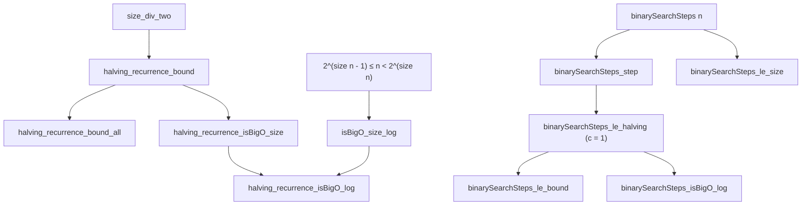

# Formalization of Halving Recurrences and Binary Search in Lean 4

This document details the Lean 4 formalization of halving recurrences, bit-size reductions,
and binary search complexity in [`Amort/Recurrence/Halving.lean`](Halving.lean) and
[`Amort/Recurrence/BinarySearch.lean`](BinarySearch.lean).

---

## 1. Problem Formulation and Setup

Decrease-and-conquer algorithms decrease problem size by a constant factor (typically $1/2$)
at each iteration. When the work done at each step is bounded by a constant $c$, the recurrence
relation is:
$$T(n) \le T(\lfloor n / 2 \rfloor) + c \quad (n \ge 2)$$

In standard computer science, this recurrence characterizes:
- Binary search in a sorted array or binary search tree.
- Exponentiation by squaring ($a^n = (a^{n/2})^2$).
- Binary GCD and bit-shifting routines.

Solving this in Lean 4 requires:
1. Connecting integer division $\lfloor n / 2 \rfloor$ to the binary representation length
   $\text{Nat.size } n$.
2. Proving concrete upper bounds in $\mathbb{N}$: $T(n) \le c \cdot \text{Nat.size } n + T(1)$.
3. Proving the asymptotic bridge $\text{Nat.size } n = O(\log n)$ under `Filter.atTop`.
4. Instantiating the theory on a formal binary search comparison counter.

---

## 2. Mathematical Architecture



---

## 3. Key Theorems and Proof Strategies

### 3.1 Bit-Size Halving Invariant
**Theorem** (`size_div_two`):
$$\forall n,\; \text{Nat.size}(n / 2) = \text{Nat.size } n - 1$$
*Strategy*: Uses `Nat.le_antisymm`. For $n > 0$ with size $k+1$, $2^k \le n < 2^{k+1}$.
Halving gives $2^{k-1} \le n/2 < 2^k$, so the bit size of $n/2$ is precisely
$k = \text{size } n - 1$.

### 3.2 Concrete Halving Recurrence Bound
**Theorem** (`halving_recurrence_bound`):
$$(\forall n \ge 2,\; T(n) \le T(n / 2) + c) \implies$$
$$\forall n \ge 1,\; T(n) \le c \cdot \text{Nat.size } n + T(1)$$
*Strategy*: Strong induction on $n$.
- Base cases: $n = 1$ gives $c \cdot 1 + T(1) \ge T(1)$.
- Inductive step ($n \ge 2$): Since $n/2 < n$ and $n/2 \ge 1$:
  $$T(n) \le T(n / 2) + c \le (c \cdot \text{Nat.size}(n / 2) + T(1)) + c$$
  Applying $\text{size}(n / 2) = \text{size } n - 1$:
  $$c \cdot (\text{size } n - 1) + c = c \cdot \text{size } n$$
  which closes the induction step cleanly without any off-by-one errors.

### 3.3 Bit-Size to Real Logarithm Bridge
**Theorem** (`isBigO_size_log`):
$$(\text{Nat.size } n : \mathbb{R}) = O(\log n) \quad \text{under } Filter.atTop$$
*Strategy*: For $n \ge 4$:
1. $2^{\text{size } n - 1} \le n \implies (\text{size } n - 1) \cdot \ln 2 \le \ln n$.
2. Hence $\text{size } n - 1 \le \frac{\ln n}{\ln 2}$.
3. For $n \ge 4$, $\frac{\ln n}{\ln 2} \ge 2$, hence $1 \le \frac{\ln n}{\ln 2}$.
4. Therefore:
   $$\text{size } n \le (\text{size } n - 1) + 1 \le 2 \frac{\ln n}{\ln 2}$$
   $$= \left(\frac{2}{\ln 2}\right) \ln n$$

### 3.4 Asymptotic Halving Bounds
- `halving_recurrence_isBigO_size`:
  $$T(n) = O(\text{Nat.size } n)$$
  using bound $(c + T(1)) \cdot \text{Nat.size } n$.
- `halving_recurrence_isBigO_log`:
  $$T(n) = O(\log n)$$
  obtained directly by composing `halving_recurrence_isBigO_size` with `isBigO_size_log`.

---

## 4. Binary Search Model and Verification

In [`Amort/Recurrence/BinarySearch.lean`](BinarySearch.lean):

```lean
def binarySearchSteps : ℕ → ℕ
  | 0 => 0
  | 1 => 1
  | n + 2 => 1 + binarySearchSteps ((n + 2) / 2)
```

1. **Recurrence Identity** (`binarySearchSteps_step`):
   For $n \ge 2$, `binarySearchSteps n = binarySearchSteps (n / 2) + 1`.
2. **General Halving Instantiation** (`binarySearchSteps_le_halving`):
   Satisfies $T(n) \le T(n / 2) + c$ with $c = 1$.
3. **Upper Bounds**:
   - Via general theorem (`binarySearchSteps_le_bound`):
     $$\text{binarySearchSteps } n \le \text{Nat.size } n + 1 \quad (n \ge 1)$$
   - Tight bit-size bound (`binarySearchSteps_le_size`):
     $$\text{binarySearchSteps } n \le \text{Nat.size } n \quad (\forall n \in \mathbb{N})$$
     proven by induction using $\text{size}((n+2)/2) = \text{size}(n+2) - 1$.
4. **Asymptotic Complexity**:
   - `binarySearchSteps_isBigO_size`: $T(n) = O(\text{Nat.size } n)$ under `Filter.atTop`.
   - `binarySearchSteps_isBigO_log`: $T(n) = O(\log n)$ under `Filter.atTop`.

### 4.1 Executable Array Binary Search (Definition of Done R2 & R4)

To resolve anti-pattern A3 and provide a concrete algorithm rather than just a recurrence,
`Amort.Recurrence.BinarySearch` defines executable binary search over sorted arrays and lists:

```lean
def binarySearch (a : Array α) (target : α) : Option (Fin a.size)
def binarySearchWithCount (a : Array α) (target : α) : Option (Fin a.size) × ℕ
```

- **Functional Correctness & Specification**:
  - `binarySearch_some_get : binarySearch xs x = some i → xs[i]? = some x`
    guaranteeing that the returned index genuinely holds the searched target.
  - `binarySearch_isSome_iff : (binarySearch xs target).isSome ↔ target ∈ xs`
    when input `xs` is sorted with respect to a linear order.
- **Instrumented Execution Equivalence**:
  `binarySearchWithCount_fst : (binarySearchWithCount a target).1 = binarySearch a target`
- **Probe Upper Bounds**:
  `binarySearchWithCount_snd_le_steps :`
  `(binarySearchWithCount a target).2 ≤ binarySearchSteps a.size`
  `binarySearchWithCount_snd_le_size : (binarySearchWithCount a target).2 ≤ Nat.size a.size`
- **Array Direct Probing**:
  `binarySearchArrayWithCount_fst`, `binarySearchArrayWithCount_snd_le_size`, and
  `binarySearchSteps_isBigO_size` linking probed runtime to $O(\text{size } n) = O(\log n)$.

---

## 5. Axiomatic Verification

Verification via `#print axioms` confirms that all theorems in `Amort.Recurrence.Halving` and
`Amort.Recurrence.BinarySearch` depend only on standard foundational Lean 4 axioms:
- `propext`
- `Classical.choice`
- `Quot.sound`
With **0 occurrences of `sorryAx`** and 0 compiler warnings.
