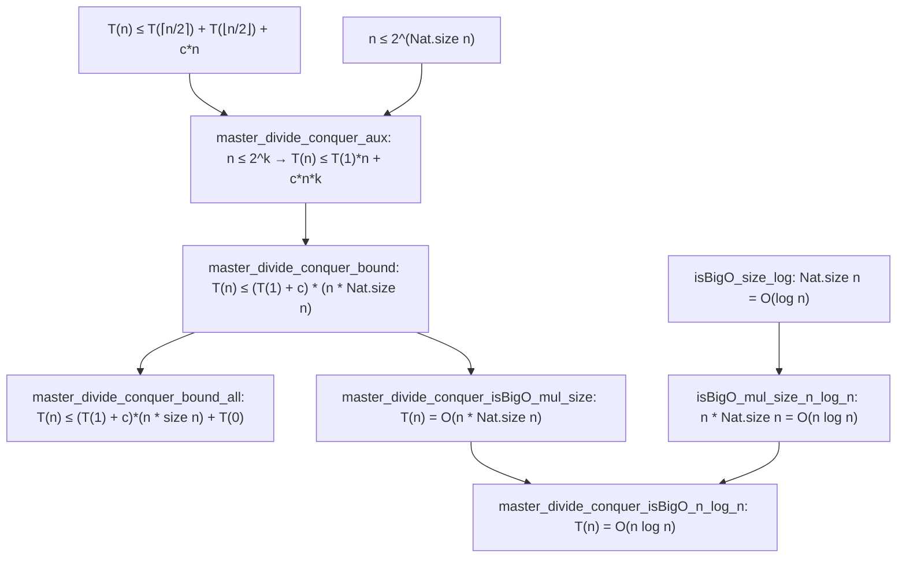

# Formalization of the Divide-and-Conquer Master Recurrence in Lean 4

This document details the Lean 4 formalization of the balanced divide-and-conquer master recurrence with integer rounding in [`Amort/Recurrence/MasterTheorem.lean`](MasterTheorem.lean).

---

## 1. Problem Formulation and Setup

Divide-and-conquer algorithms split an input of size $n$ into two roughly equal halves $\lceil n / 2 \rceil = (n + 1)/2$ and $\lfloor n / 2 \rfloor = n / 2$, recursively solve both, and combine the solutions in linear time $c \cdot n$.

The resulting recurrence is:
$$T(n) \le T\left(\left\lceil \frac{n}{2} \right\rceil\right) + T\left(\left\lfloor \frac{n}{2} \right\rfloor\right) + c \cdot n \quad (n \ge 2)$$

This is Case 2 of the classical Master Theorem ($a = 2, b = 2, f(n) = \Theta(n)$), which yields $O(n \log n)$.

In Lean 4, formalizing this requires addressing integer rounding:
1. Exact conservation of size: $\lceil n / 2 \rceil + \lfloor n / 2 \rfloor = (n + 1)/2 + n/2 = n$.
2. Both subproblems are bounded by $2^{k-1}$ when $n \le 2^k$.
3. Dyadic induction on the exponent $k$ in powers of 2.
4. Concrete $\mathbb{N}$-bounds via $\text{Nat.size } n$.
5. Mathlib `IsBigO` asymptotic bridge under `Filter.atTop`.

---

## 2. Mathematical Architecture

---

## 3. Key Theorems and Proof Strategies

### 3.1 Dyadic Induction Lemma
**Theorem** (`master_divide_conquer_aux`):
$$(\forall n \ge 2,\; T(n) \le T((n+1)/2) + T(n/2) + c \cdot n) \implies \forall k\; n,\; 1 \le n \le 2^k \implies T(n) \le T(1) \cdot n + c \cdot n \cdot k$$

*Strategy*: Induction on the power of two exponent $k$.
- **Base case** ($k = 0$): $1 \le n \le 2^0 = 1 \implies n = 1$. Then $T(1) \le T(1) \cdot 1 + c \cdot 1 \cdot 0 = T(1)$.
- **Inductive step** ($k + 1$):
  - If $n < 2$, $n = 1$, which holds trivially.
  - If $n \ge 2$, both subproblem sizes $n_1 = (n+1)/2$ and $n_2 = n/2$ satisfy $1 \le n_i \le 2^k$.
  - By induction hypothesis:
    $$T(n_1) \le T(1) \cdot n_1 + c \cdot n_1 \cdot k$$
    $$T(n_2) \le T(1) \cdot n_2 + c \cdot n_2 \cdot k$$
  - Adding the two bounds and using exact partition $n_1 + n_2 = n$:
    $$T(n_1) + T(n_2) \le T(1)(n_1 + n_2) + c \cdot k(n_1 + n_2) = T(1) \cdot n + c \cdot k \cdot n$$
  - Adding the combine cost $c \cdot n$:
    $$T(n) \le T(1) \cdot n + c \cdot k \cdot n + c \cdot n = T(1) \cdot n + c \cdot n \cdot (k + 1)$$
  This completes the induction step with exact integer arithmetic.

### 3.2 Concrete Bit-Size Upper Bound
**Theorem** (`master_divide_conquer_bound`):
$$\forall n \ge 1,\; T(n) \le (T(1) + c) \cdot (n \cdot \text{Nat.size } n)$$
*Strategy*: Since $n < 2^{\text{Nat.size } n}$ (`Nat.lt_size_self`), we set $k = \text{Nat.size } n$ in `master_divide_conquer_aux`:
$$T(n) \le T(1) \cdot n + c \cdot n \cdot \text{Nat.size } n \le (T(1) + c) \cdot (n \cdot \text{Nat.size } n)$$

- Global version (`master_divide_conquer_bound_all`):
  $$T(n) \le (T(1) + c) \cdot (n \cdot \text{Nat.size } n) + T(0) \quad (\forall n \in \mathbb{N})$$

### 3.3 Asymptotic Complexity Bridge
1. **Bit-Size Complexity** (`master_divide_conquer_isBigO_mul_size`):
   $$T(n) = O(n \cdot \text{Nat.size } n) \quad \text{under } Filter.atTop$$
   holding with multiplier constant $T(1) + c$.
2. **Product Logarithmic Scaling** (`isBigO_mul_size_n_log_n`):
   Multiplies identity $n = O(n)$ with $\text{Nat.size } n = O(\log n)$ using `Asymptotics.IsBigO.mul`:
   $$n \cdot \text{Nat.size } n = O(n \log n) \quad \text{under } Filter.atTop$$
3. **Master Recurrence Asymptotics** (`master_divide_conquer_isBigO_n_log_n`):
   $$T(n) = O(n \log n) \quad \text{under } Filter.atTop$$
   by transitivity of `IsBigO`.

---

## 4. Downstream Application: Merge Sort

In [`Amort/Sorting/MergeSort.lean`](../Sorting/MergeSort.lean) and [`Amort/Sorting/Asymptotics.lean`](../Sorting/Asymptotics.lean):
1. Merging sublists of lengths $n_1, n_2$ consumes $\le n_1 + n_2 = n$ comparisons.
2. The recurrence bound `mergeSortRecBound` satisfies:
   $$\text{mergeSortRecBound } n \le \text{mergeSortRecBound } ((n+1)/2) + \text{mergeSortRecBound } (n/2) + 1 \cdot n$$
   with $c = 1$ and $T(1) = 0$.
3. Instantiating `master_divide_conquer_bound` gives:
   $$\text{mergeSortRecBound } n \le n \cdot \text{Nat.size } n$$
4. Instantiating `master_divide_conquer_isBigO_n_log_n` establishes:
   $$\text{mergeSortRecBound } n = O(n \log n) \quad \text{under } Filter.atTop$$

---

## 5. Axiomatic Verification

Inspection via `#print axioms` confirms that all master theorem results depend exclusively on standard foundational Lean 4 axioms:
- `propext`
- `Classical.choice`
- `Quot.sound`
With **0 occurrences of `sorryAx`** and 0 compiler warnings.
