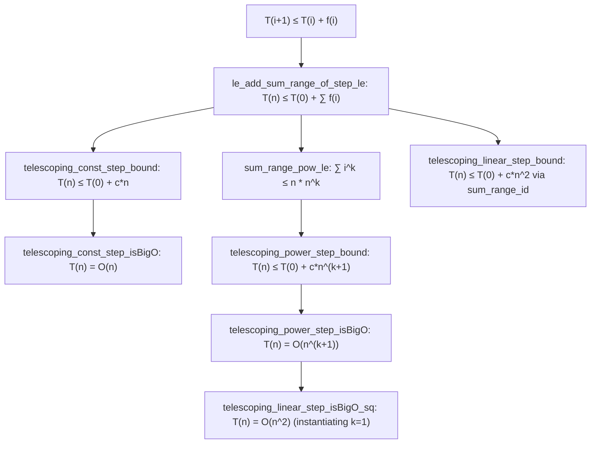

# Formalization of Linear and Telescoping Recurrences in Lean 4

This document details the Lean 4 formalization of general telescoping loop recurrences and their asymptotic complexity in [`Amort/Recurrence/Telescoping.lean`](Telescoping.lean).

---

## 1. Problem Formulation and Setup

Many iterative algorithms maintain an invariant across iterations $i = 0, 1, \dots, n-1$, where the $i$-th iteration performs work bounded by a function of the current problem size $f(i)$:
$$T(i + 1) \le T(i) + f(i)$$

Rather than computing exact closed forms for every algorithm, we formalize the general telescoping framework:
1. **General Telescoping Identity**:
   $$T(n) \le T(0) + \sum_{i=0}^{n-1} f(i)$$
2. **Constant Step Recurrences ($f(i) = c$)**:
   $$\sum_{i=0}^{n-1} c = c \cdot n \implies T(n) \le T(0) + c \cdot n \implies T(n) = O(n)$$
3. **General Power Step Recurrences ($f(i) = c \cdot i^k$)**:
   $$\sum_{i=0}^{n-1} c \cdot i^k \le c \cdot n \cdot n^k = c \cdot n^{k+1} \implies T(n) = O(n^{k+1})$$
4. **Linear Step ($k = 1$, Quadratic Complexity)**:
   $$f(i) = c \cdot i \implies \sum_{i=0}^{n-1} i = \frac{n(n-1)}{2} \le n^2 \implies T(n) = O(n^2)$$

This establishes the formal basis for iterative algorithms like Insertion Sort ($k=1$), Bubble Sort, and Selection Sort.

---

## 2. Mathematical Architecture

The proof hierarchy in [`Amort/Recurrence/Telescoping.lean`](Telescoping.lean):

---

## 3. Key Theorems and Proof Strategies

### 3.1 Fundamental Telescoping Inequality
**Theorem** (`le_add_sum_range_of_step_le`):
$$(\forall i,\; T(i + 1) \le T(i) + f(i)) \implies \forall n,\; T(n) \le T(0) + \sum_{i=0}^{n-1} f(i)$$
*Strategy*: Standard induction on $n$.
- Base case ($n = 0$): $T(0) \le T(0) + 0$ holds trivially.
- Inductive step: $T(n+1) \le T(n) + f(n) \le (T(0) + \sum_{i < n} f(i)) + f(n) = T(0) + \sum_{i < n+1} f(i)$ via `Finset.sum_range_succ`.

### 3.2 Constant Step Recurrence
- **Concrete Bound** (`telescoping_const_step_bound`):
  Evaluates $\sum_{i < n} c = n \cdot c$ via `sum_range_const`, yielding $T(n) \le T(0) + c \cdot n$.
- **Asymptotic Bound** (`telescoping_const_step_isBigO`):
  For $n \ge 1$, $T(0) \le T(0) \cdot n$, so $T(n) \le (T(0) + c) \cdot n$, giving $O(n)$ with constant $T(0) + c$.

### 3.3 General Power Step Recurrence
- **Power Sum Bound** (`sum_range_pow_le`):
  For any $i < n$, $i^k \le n^k$. Bounding all $n$ terms by $n^k$ gives $\sum_{i=0}^{n-1} i^k \le n \cdot n^k = n^{k+1}$ via `Finset.sum_le_card_nsmul`.
- **Concrete Power Bound** (`telescoping_power_step_bound`):
  $$T(n) \le T(0) + c \cdot n^{k+1}$$
- **Asymptotic Power Bound** (`telescoping_power_step_isBigO`):
  $$T(n) = O(n^{k+1}) \quad \text{under } Filter.atTop$$
  Using multiplier constant $M = T(0) + c$.

### 3.4 Linear Step Recurrence ($k = 1$)
- **Concrete Quadratic Bound** (`telescoping_linear_step_bound`):
  Uses Gauss's summation formula `Finset.sum_range_id` ($\sum_{i=0}^{n-1} i = n(n-1)/2$). Since $n(n-1)/2 \le n^2$, we obtain:
  $$T(n) \le T(0) + c \cdot n^2$$
- **Asymptotic Quadratic Bound** (`telescoping_linear_step_isBigO_sq`):
  Directly instantiates `telescoping_power_step_isBigO` with $k = 1$, using $i^1 = i$ and $1 + 1 = 2$.

---

## 4. Downstream Applications

- **Insertion Sort** ([`Amort/Sorting/InsertionSort.lean`](../Sorting/InsertionSort.lean)):
  Inserting an element into a sorted list of length $i$ takes at most $i$ comparisons.
  The total comparison count satisfies $T(i+1) \le T(i) + 1 \cdot i$.
  By mapping directly to `telescoping_linear_step_bound` and `telescoping_linear_step_isBigO_sq`, the $O(n^2)$ worst-case comparison complexity follows without manual sum expansions.

---

## 5. Axiomatic Verification

Inspection via `#print axioms` confirms that all theorems in `Amort.Recurrence.Telescoping` depend exclusively on standard foundational Lean 4 axioms:
- `propext`
- `Classical.choice`
- `Quot.sound`
With **0 occurrences of `sorryAx`** and 0 compiler warnings.
