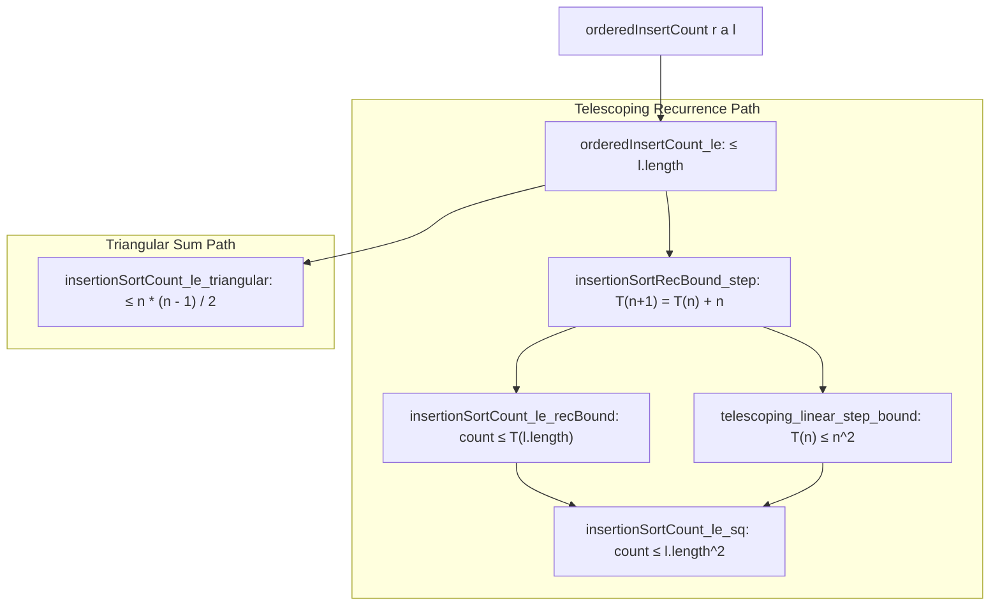

# Formalization of Insertion Sort Complexity in Lean 4

This document details the Lean 4 formalization of comparison counting, mathematical equivalence, and $O(n^2)$ time complexity for Insertion Sort in [`Amort/Sorting/InsertionSort.lean`](InsertionSort.lean) and [`Amort/Sorting/Asymptotics.lean`](Asymptotics.lean).

---

## 1. Problem Formulation and Setup

Mathlib formalizes insertion sort (`List.insertionSort`) over a list $l$ of type `List α` via a right fold using `List.orderedInsert`:
```lean
def orderedInsert (a : α) : List α → List α
  | [] => [a]
  | b :: l => if a ≼ b then a :: b :: l else b :: orderedInsert a l

def insertionSort : List α → List α := foldr (orderedInsert r) []
```
In worst-case scenarios (e.g. reverse-sorted lists), inserting an element into a sorted prefix of length $k$ compares the new element against all $k$ existing elements, leading to $\Theta(n^2)$ total comparisons.

---

## 2. Comparison Counting and Instrumented Models

We define two complementary representations:

### 2.1 Direct Comparison Counters
```lean
def orderedInsertCount (r : α → α → Prop) [DecidableRel r] (a : α) : List α → ℕ
  | [] => 0
  | b :: l => if r a b then 1 else 1 + orderedInsertCount r a l

def insertionSortCount (r : α → α → Prop) [DecidableRel r] : List α → ℕ
  | [] => 0
  | a :: l => orderedInsertCount r a (insertionSort r l) + insertionSortCount r l
```

### 2.2 Instrumented Sorting Representations
To verify that tracking comparisons does not alter the underlying algorithm, instrumented functions return both the sorted output and comparison counter:
```lean
def orderedInsertWithCount (r : α → α → Prop) [DecidableRel r] (a : α) :
    List α → List α × ℕ

def insertionSortWithCount (r : α → α → Prop) [DecidableRel r] :
    List α → List α × ℕ
```

### 2.3 Equivalence with Mathlib
By structural induction on list $l$:
- `orderedInsertWithCount_fst`: `(orderedInsertWithCount r a l).1 = List.orderedInsert r a l`
- `orderedInsertWithCount_snd`: `(orderedInsertWithCount r a l).2 = orderedInsertCount r a l`
- `insertionSortWithCount_fst`: `(insertionSortWithCount r l).1 = List.insertionSort r l`
- `insertionSortWithCount_snd`: `(insertionSortWithCount r l).2 = insertionSortCount r l`

---

## 3. Proof Strategy & Invariant Hierarchy

The proof derives the quadratic bound through two distinct mathematical pathways:
1. **The Telescoping Recurrence Pathway** (via `Amort.Recurrence.Telescoping`).
2. **The Exact Triangular Summation Pathway** ($\frac{n(n-1)}{2}$).



### 3.1 Single-Insertion Bound
**Theorem** (`orderedInsertCount_le`):
$$\forall a\ l,\; \text{orderedInsertCount } r\ a\ l \le l.\text{length}$$
*Strategy*: Structural induction on $l$.
- Base case $l = []$: $0 \le 0$.
- Inductive step $b :: l'$: If $r\ a\ b$ holds, 1 comparison $\le 1 + |l'|$. If $\neg r\ a\ b$, 1 comparison $+$ recursive comparisons $\le 1 + |l'|$ by induction hypothesis.

### 3.2 Telescoping Recurrence Bound
Insertion sort matches the recurrence $T(0) = 0, T(n+1) = T(n) + n$:
```lean
def insertionSortRecBound : ℕ → ℕ
  | 0 => 0
  | n + 1 => insertionSortRecBound n + n
```
- **Step Bound** (`insertionSortCount_le_recBound`):
  $$\text{insertionSortCount } r\ l \le \text{insertionSortRecBound } l.\text{length}$$
  By induction on $l$, using `List.length_insertionSort` ($|insertionSort(l)| = |l|$) and `orderedInsertCount_le`.
- **Quadratic Bound** (`insertionSortRecBound_le_sq`):
  Applying `Amort.Recurrence.telescoping_linear_step_bound 1` yields:
  $$\text{insertionSortRecBound } n \le n^2$$
- **Final Concrete Bound** (`insertionSortCount_le_sq`):
  $$\text{insertionSortCount } r\ l \le l.\text{length}^2$$

### 3.3 Exact Triangular Number Bound
**Theorem** (`insertionSortCount_le_triangular`):
$$\text{insertionSortCount } r\ l \le \frac{l.\text{length} \cdot (l.\text{length} - 1)}{2}$$
*Strategy*: Induction on $l$. In the inductive step, $(n+1)n/2 = n(n-1)/2 + n$. Applying Mathlib's `Nat.add_mul_div_right` discharges the arithmetic.

---

## 4. Asymptotic Complexity Bridge

In [`Amort/Sorting/Asymptotics.lean`](Asymptotics.lean):
1. **Arbitrary Filter Bound** (`isBigO_insertionSortCount_sq`):
   $$\text{insertionSortCount } r\ l = O(l.\text{length}^2) \quad \text{under any filter } F \text{ on } List\ \alpha$$
   since the bound holds pointwise with constant $c = 1$.
2. **Pullback Filter Bound** (`isBigO_insertionSortCount_atTop`):
   Asymptotics under `Filter.comap List.length Filter.atTop`.
3. **Recurrence Bound Asymptotics** (`isBigO_insertionSortRecBound_atTop`):
   Directly derived via `Amort.Recurrence.telescoping_linear_step_isBigO_sq 1`.

---

## 5. Axiomatic Verification

Verification via `#print axioms` confirms that all insertion sort theorems depend solely on standard foundational Lean 4 axioms:
- `propext`
- `Classical.choice`
- `Quot.sound`
With **0 occurrences of `sorryAx`** and 0 compiler warnings.
