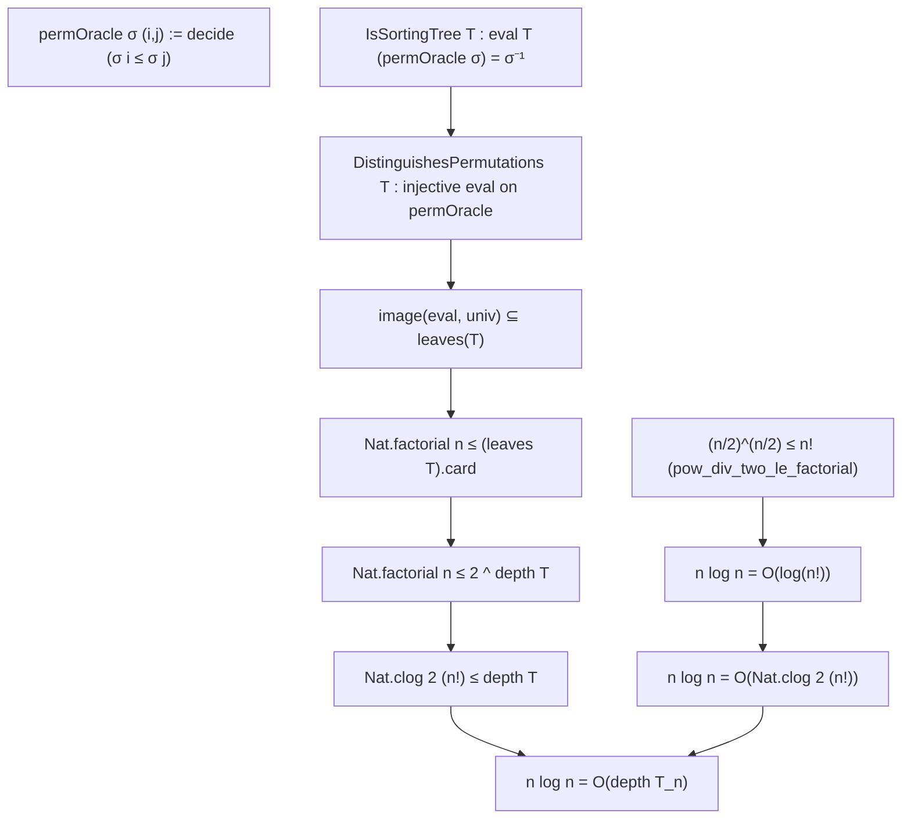

# Formalization of the Comparison-Based Sorting Lower Bound ($\Omega(n \log n)$) in Lean 4

This document details the Lean 4 formalization of the information-theoretic lower bound for comparison-based sorting in [`Amort/Sorting/DecisionTree.lean`](DecisionTree.lean) and [`Amort/Sorting/LowerBound.lean`](LowerBound.lean).

---

## 1. Mathematical Architecture & Setup

Any comparison-based algorithm operating on $n$ elements (indexed by `Fin n`) resolves information solely by querying a binary comparison oracle $(i, j) \mapsto \sigma(i) \le \sigma(j)$, where $\sigma \in S_n$ is the secret input permutation.

The execution of any such algorithm is modeled as an abstract binary decision tree $T$:
1. **Internal Nodes**: Contain comparison queries $q \in \text{Fin } n \times \text{Fin } n$.
2. **Edges**: Branch left on `true` ($\sigma(i) \le \sigma(j)$) and right on `false` ($\sigma(i) > \sigma(j)$).
3. **Leaves**: Output the restored permutation $\sigma^{-1}$ or sorted array.
4. **Depth / Height**: Corresponds to the worst-case number of comparisons on any input.

### Information-Theoretic Chain
For any correct sorting algorithm:
1. **Permutation Coverage**: There are $n!$ distinct input permutations in $S_n$. To correctly output $\sigma^{-1}$, the tree must evaluate to distinct leaves on distinct inputs:
   $$n! \le |leaves(T)| \le \text{leafCount}(T)$$
2. **Binary Tree Capacity**: A binary tree of depth $d$ has at most $2^d$ leaves:
   $$\text{leafCount}(T) \le 2^{\text{depth}(T)}$$
3. **Worst-Case Query Lower Bound**:
   $$n! \le 2^{\text{depth}(T)} \implies \text{depth}(T) \ge \lceil \log_2(n!) \rceil$$
4. **Factorial Growth**:
   $$n! \ge (n/2)^{n/2} \implies \log(n!) = \Omega(n \log n)$$

---

## 2. Decision Tree Formalization

In [`Amort/Sorting/DecisionTree.lean`](DecisionTree.lean):

```lean
inductive DecisionTree (α : Type u) (β : Type v) where
  | leaf (val : β) : DecisionTree α β
  | node (query : α) (left right : DecisionTree α β) : DecisionTree α β

def depth : DecisionTree α β → ℕ
  | leaf _ => 0
  | node _ left right => max (depth left) (depth right) + 1

def leafCount : DecisionTree α β → ℕ
  | leaf _ => 1
  | node _ left right => leafCount left + leafCount right

def eval (T : DecisionTree α β) (oracle : α → Bool) : β :=
  match T with
  | leaf val => val
  | node query left right =>
    if oracle query then eval left oracle else eval right oracle
```

### 2.1 Fundamental Structural Capacity Lemma
**Theorem** (`leafCount_le_two_pow_depth`):
$$\forall T,\; \text{leafCount}(T) \le 2^{\text{depth}(T)}$$
*Strategy*: Structural induction on $T$. The base case is $1 \le 2^0 = 1$. At node $(q, l, r)$, both subtrees have depth $\le \max(d_l, d_r)$. The sum of capacities is $2^{\max} + 2^{\max} = 2 \cdot 2^{\max} = 2^{\max + 1}$.

### 2.2 Leaf Sets and Reachability
- `leavesList T : List β` accumulates all leaves with multiplicity (`(leavesList T).length = leafCount T`).
- `leaves T : Finset β := (leavesList T).toFinset` collects unique leaf values.
- `card_leaves_le_two_pow_depth`:
  $$|(leaves\ T)| \le \text{leafCount}(T) \le 2^{\text{depth}(T)}$$

---

## 3. Permutation Coverage & Asymptotic Lower Bound

In [`Amort/Sorting/LowerBound.lean`](LowerBound.lean):



### 3.1 Permutation Coverage Theorem
**Theorem** (`factorial_le_two_pow_depth`):
$$\text{DistinguishesPermutations}(T) \implies n! \le 2^{\text{depth}(T)}$$
*Strategy*:
1. By injectivity of `eval T (permOracle ·)`, the image `Finset.image f Finset.univ` has cardinality $|S_n| = n!$ (via `Fintype.card_perm`).
2. Every evaluation terminates at some leaf: `image f univ ⊆ leaves T`.
3. Thus $n! \le |leaves(T)| \le \text{leafCount}(T) \le 2^{\text{depth}(T)}$.

### 3.2 Concrete Ceiling Logarithm Bound
**Theorem** (`clog_factorial_le_depth`):
$$\text{Nat.clog } 2\ (n!) \le \text{depth}(T)$$
Directly follows from `Nat.clog_le_of_le_pow` applied to $n! \le 2^d$.

### 3.3 Combinatorial Factorial Lower Bound
**Lemma** (`pow_div_two_le_factorial`):
$$\forall n,\; (n / 2)^{n / 2} \le n!$$
*Strategy*: Using `Nat.factorial_mul_pow_le_factorial`, we partition $n! = (n/2)! \cdot \prod_{i=1}^{n - n/2} (n/2 + i) \ge 1 \cdot (n/2 + 1)^{n - n/2} \ge (n/2)^{n/2}$.

---

## 4. Asymptotic Complexity Bridge

Using Mathlib's `Mathlib.Analysis.Asymptotics.IsBigO`:

1. **Lower Bound Dominance** (`isBigO_n_log_n_factorial`):
   $$(n \log n) = O(\log(n!)) \quad \text{under } Filter.atTop$$
   *Proof Idea*: For $n \ge 6$, $n \le 3(n/2)$ and $n \le (n/2)^2$, yielding:
   $$n \log n \le 6 \cdot (n/2) \log(n/2) = 6 \log((n/2)^{n/2}) \le 6 \log(n!)$$
2. **Upper Bound Dominance** (`isBigO_factorial_n_log_n`):
   $$\log(n!) = O(n \log n) \quad \text{via } n! \le n^n$$
3. **Theta Equivalence** (`isTheta_factorial_n_log_n`):
   $$\log(n!) = \Theta(n \log n) \quad \text{under } Filter.atTop$$
4. **Information-Theoretic Lower Bound for Any Sorter Family** (`isBigO_n_log_n_depth`):
   For any sequence of trees $T_n$ distinguishing all permutations of $n$ elements:
   $$n \log n = O(\text{depth}(T_n)) \quad \text{under } Filter.atTop$$

---

## 5. Axiomatic Verification

Inspection via `#print axioms` verifies that all decision tree and lower bound theorems depend solely on standard foundational Lean 4 axioms:
- `propext`
- `Classical.choice`
- `Quot.sound`
With **0 occurrences of `sorryAx`** and 0 compiler warnings.
