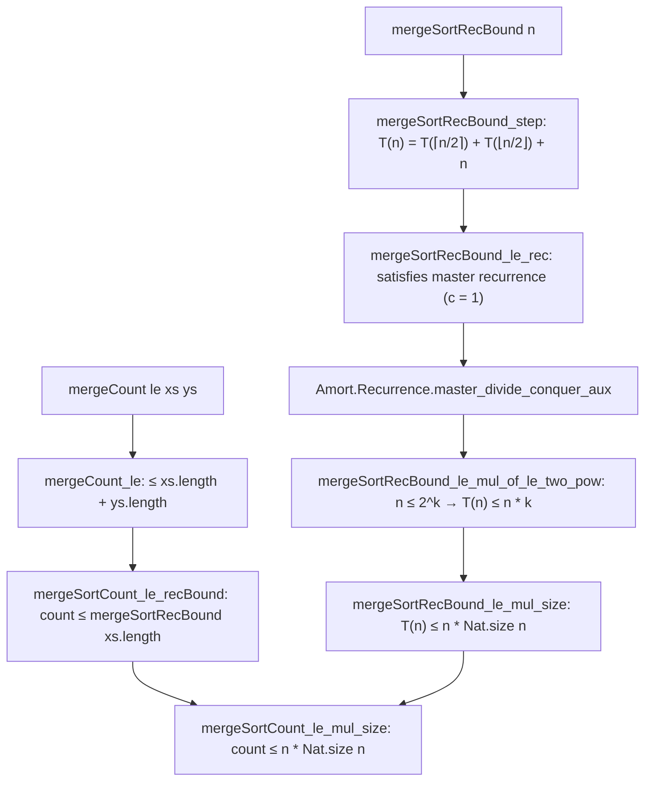

# Formalization of Merge Sort Complexity in Lean 4

This document details the Lean 4 formalization of comparison counting, mathematical equivalence, and $O(n \log n)$ time complexity for Merge Sort in [`Amort/Sorting/MergeSort.lean`](MergeSort.lean) and [`Amort/Sorting/Asymptotics.lean`](Asymptotics.lean).

---

## 1. Problem Formulation and Setup

Lean core / Mathlib defines `List.merge` and `List.mergeSort`:
- `List.merge xs ys le`: Merges two sorted lists by comparing heads `le x y`.
- `List.mergeSort xs le`: Recursively splits `xs` via `splitInTwo` into sublists of lengths $\lceil n / 2 \rceil = (n + 3)/2$ and $\lfloor n / 2 \rfloor = (n + 2)/2$, recursively sorts each, and merges the results.

In divide-and-conquer sorting, merging subproblems of sizes $m$ and $k$ requires at most $m + k$ comparisons. Solving the balanced recurrence $T(n) \le T(\lceil n/2 \rceil) + T(\lfloor n/2 \rfloor) + n$ yields the optimal $O(n \log n)$ comparison bound.

---

## 2. Comparison Counting and Instrumented Models

### 2.1 Merge Comparison Counter
```lean
def mergeCount (le : α → α → Bool) : List α → List α → ℕ
  | [], _ => 0
  | _ :: _, [] => 0
  | x :: xs, y :: ys =>
    if le x y then 1 + mergeCount le xs (y :: ys)
    else 1 + mergeCount le (x :: xs) ys
```
Instrumented version `mergeWithCount le xs ys : List α × ℕ` is proven equivalent:
- `(mergeWithCount le xs ys).1 = merge xs ys le` (`mergeWithCount_fst`)
- `(mergeWithCount le xs ys).2 = mergeCount le xs ys` (`mergeWithCount_snd`)

### 2.2 Full Merge Sort Counter
```lean
def mergeSortCount (le : α → α → Bool) : List α → ℕ
  | [] => 0
  | [_] => 0
  | a :: b :: xs =>
    let lr := List.MergeSort.Internal.splitInTwo ⟨a :: b :: xs, rfl⟩
    mergeSortCount le lr.1.1 + mergeSortCount le lr.2.1 +
      mergeCount le (List.mergeSort lr.1.1 le) (List.mergeSort lr.2.1 le)
```
Instrumented version `mergeSortWithCount le xs : List α × ℕ` satisfies:
- `(mergeSortWithCount le xs).1 = mergeSort xs le` (`mergeSortWithCount_fst`)
- `(mergeSortWithCount le xs).2 = mergeSortCount le xs` (`mergeSortWithCount_snd`)
- `(mergeSortWithCount (r · ·) xs).1 = insertionSort r xs` for linear orders (`mergeSortWithCount_fst_eq_insertionSort`).

---

## 3. Proof Strategy & Master Theorem Integration

The proof strategy connects the concrete execution of `mergeSortCount` to the balanced divide-and-conquer master recurrence from `Amort.Recurrence.MasterTheorem`:



### 3.1 Linear Merge Bound
**Theorem** (`mergeCount_le`):
$$\forall xs\ ys,\; \text{mergeCount } le\ xs\ ys \le xs.\text{length} + ys.\text{length}$$
*Strategy*: Well-founded induction on $|xs| + |ys|$. Each comparison consumes at least one element from the inputs, so the step cost decreases the remaining length sum by 1.

### 3.2 Divide-and-Conquer Recurrence
```lean
def mergeSortRecBound : ℕ → ℕ
  | 0 => 0
  | 1 => 0
  | n + 2 =>
    mergeSortRecBound ((n + 3) / 2) + mergeSortRecBound ((n + 2) / 2) + (n + 2)
```
- **Reduction** (`mergeSortCount_le_recBound`):
  $$\text{mergeSortCount } le\ xs \le \text{mergeSortRecBound } xs.\text{length}$$
  By structural induction on $xs$, observing that `List.length_mergeSort` preserves length ($|mergeSort(l)| = |l|$), and `splitInTwo` partitions lengths into $(n+3)/2$ and $(n+2)/2$.

### 3.3 Derivation via Master Theorem
- **Recurrence Satisfaction** (`mergeSortRecBound_le_rec`):
  For $n \ge 2$:
  $$\text{mergeSortRecBound } n \le \text{mergeSortRecBound } ((n + 1)/2) + \text{mergeSortRecBound } (n/2) + 1 \cdot n$$
- **Dyadic Induction** (`mergeSortRecBound_le_mul_of_le_two_pow`):
  Derived directly by instantiating `Amort.Recurrence.master_divide_conquer_aux` with $c = 1, T(1) = 0$:
  $$n \le 2^k \implies \text{mergeSortRecBound } n \le n \cdot k$$
- **Bit-Size Logarithmic Bound** (`mergeSortRecBound_le_mul_size`):
  Setting $k = \text{Nat.size } n$ (since $n \le 2^{\text{size } n}$ by `Nat.lt_size_self`):
  $$\text{mergeSortRecBound } n \le n \cdot \text{Nat.size } n$$
- **Final List Bound** (`mergeSortCount_le_mul_size`):
  $$\text{mergeSortCount } le\ xs \le xs.\text{length} \cdot \text{Nat.size } xs.\text{length}$$

---

## 4. Asymptotic Complexity Bridge

In [`Amort/Sorting/Asymptotics.lean`](Asymptotics.lean):
1. **Arbitrary Filter Bound** (`isBigO_mergeSortCount_mul_size`):
   $$\text{mergeSortCount } le\ l = O(l.\text{length} \cdot \text{Nat.size } l.\text{length}) \quad \text{under any filter } F$$
   holding pointwise everywhere with constant $c = 1$.
2. **Pullback Filter Bound** (`isBigO_mergeSortCount_atTop`):
   Asymptotics under `Filter.comap List.length Filter.atTop`.
3. **Master Recurrence Asymptotics** (`isBigO_mergeSortRecBound_n_log_n`):
   Directly derived via `Amort.Recurrence.master_divide_conquer_isBigO_n_log_n`:
   $$\text{mergeSortRecBound } n = O(n \log n) \quad \text{under } Filter.atTop$$

---

## 5. Axiomatic Verification

Verification via `#print axioms` confirms that all merge sort theorems depend solely on standard foundational Lean 4 axioms:
- `propext`
- `Classical.choice`
- `Quot.sound`
With **0 occurrences of `sorryAx`** and 0 compiler warnings.
