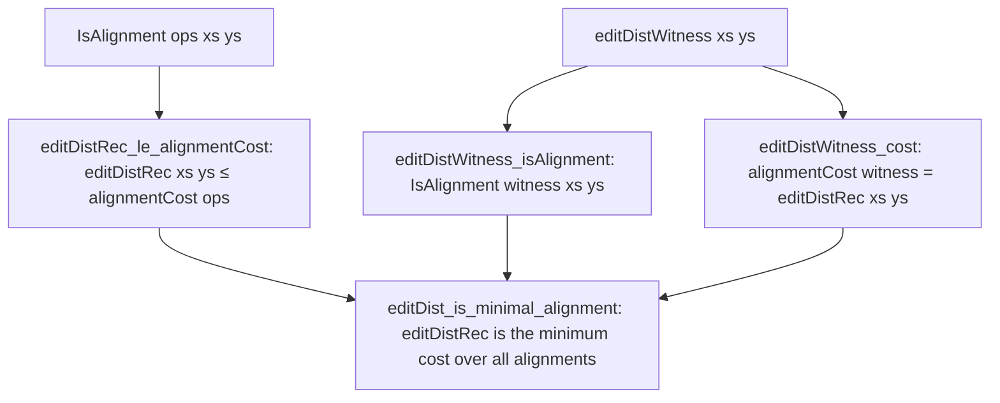

# Formalization of Edit Distance (Levenshtein Distance) in Lean 4

This document details the Lean 4 formalization of the Edit Distance (Levenshtein Distance) dynamic programming algorithm in [`Amort/String/EditDistance.lean`](EditDistance.lean): the formal alignment model `IsAlignment`, constructive witness extraction, the minimal-cost optimality theorem, the bottom-up $(n + 1) \times (m + 1)$ dynamic programming matrix, and asymptotic complexity $O(n \cdot m)$.

---

## 1. Problem Formulation and Setup

Given two sequences $xs$ of length $n$ and $ys$ of length $m$ over a type $\alpha$ with decidable equality (`[DecidableEq α]`):
- The **Levenshtein distance** measures the minimum cost sequence of edit operations (substitutions, insertions, and deletions) required to transform $xs$ into $ys$.
- Standard unit costs:
  - Match: cost 0.
  - Substitution (mismatch): cost 1.
  - Insertion: cost 1.
  - Deletion: cost 1.

### Bellman Recurrence
The optimal substructure property yields the recurrence:
$$E([], ys) = |ys|, \quad E(xs, []) = |xs|$$
$$E(x :: xs, y :: ys) = \min \begin{cases} (\text{if } x = y \text{ then } 0 \text{ else } 1) + E(xs, ys) & \text{(match / substitute)} \\ 1 + E(xs, y :: ys) & \text{(delete } x) \\ 1 + E(x :: xs, ys) & \text{(insert } y) \end{cases}$$

---

## 2. Formal Alignment Model

To prove that `editDistRec` actually computes the minimum over all possible alignments, we formalize edit operations and valid alignments inductively:

### 2.1 Edit Operations and Costs
```lean
inductive EditOp (α : Type*)
  | match_sub (x y : α)
  | delete (x : α)
  | insert (y : α)

def opCost : EditOp α → ℕ
  | EditOp.match_sub x y => if x = y then 0 else 1
  | EditOp.delete _ => 1
  | EditOp.insert _ => 1

def alignmentCost (ops : List (EditOp α)) : ℕ :=
  (ops.map opCost).sum
```

### 2.2 Inductive Alignment Relation
```lean
inductive IsAlignment : List (EditOp α) → List α → List α → Prop
  | nil : IsAlignment [] [] []
  | match_sub (x y : α) (ops : List (EditOp α)) (xs ys : List α) :
      IsAlignment ops xs ys → IsAlignment (EditOp.match_sub x y :: ops) (x :: xs) (y :: ys)
  | delete (x : α) (ops : List (EditOp α)) (xs ys : List α) :
      IsAlignment ops xs ys → IsAlignment (EditOp.delete x :: ops) (x :: xs) ys
  | insert (y : α) (ops : List (EditOp α)) (xs ys : List α) :
      IsAlignment ops xs ys → IsAlignment (EditOp.insert y :: ops) xs (y :: ys)
```

---

## 3. Proof Strategy: Minimal Cost Optimality

The optimality proof establishes a two-sided bound:
$$\forall \text{ops},\; \text{IsAlignment ops } xs\ ys \implies editDistRec\ xs\ ys \le alignmentCost\ \text{ops}$$
$$\exists \text{witness},\; \text{IsAlignment witness } xs\ ys \land alignmentCost\ \text{witness} = editDistRec\ xs\ ys$$



### 3.1 Soundness: Every Alignment Costs at Least `editDistRec`
**Theorem** (`editDistRec_le_alignmentCost`):
$$\forall ops\ xs\ ys,\; \text{IsAlignment } ops\ xs\ ys \implies editDistRec\ xs\ ys \le alignmentCost\ ops$$

*Proof Strategy*:
Induction on the derivation of `IsAlignment ops xs ys`:
1. **Base case** `nil`: $E([], []) = 0 \le 0$.
2. **Match/Sub case** (`match_sub x y ops xs ys`):
   $alignmentCost = (\text{if } x = y \text{ then } 0 \text{ else } 1) + alignmentCost(ops)$.
   By recurrence definition, $E(x :: xs, y :: ys) \le (\text{if } x = y \text{ then } 0 \text{ else } 1) + E(xs, ys)$.
   Applying the induction hypothesis completes the step.
3. **Delete case** (`delete x ops xs ys`):
   $alignmentCost = 1 + alignmentCost(ops)$.
   $E(x :: xs, ys) \le 1 + E(xs, ys)$. Discharged via `Nat.le_trans` with the induction hypothesis.
4. **Insert case** (`insert y ops xs ys`):
   $alignmentCost = 1 + alignmentCost(ops)$.
   $E(xs, y :: ys) \le 1 + E(xs, ys)$. Discharged similarly.

### 3.2 Constructive Completeness: Witness Extraction
```lean
def editDistWitness : List α → List α → List (EditOp α)
  | [], [] => []
  | x :: xs, [] => EditOp.delete x :: editDistWitness xs []
  | [], y :: ys => EditOp.insert y :: editDistWitness [] ys
  | x :: xs, y :: ys =>
    let w_sub := EditOp.match_sub x y :: editDistWitness xs ys
    let w_del := EditOp.delete x :: editDistWitness xs (y :: ys)
    let w_ins := EditOp.insert y :: editDistWitness (x :: xs) ys
    let c_sub := alignmentCost w_sub
    let c_del := alignmentCost w_del
    let c_ins := alignmentCost w_ins
    if c_sub ≤ c_del ∧ c_sub ≤ c_ins then w_sub
    else if c_del ≤ c_ins then w_del
    else w_ins
termination_by xs ys => xs.length + ys.length
```

- **Validity** (`editDistWitness_isAlignment`): Proves by well-founded induction that `editDistWitness xs ys` satisfies `IsAlignment (witness) xs ys`.
- **Exact Cost** (`editDistWitness_cost`): Proves by well-founded induction that $alignmentCost(witness) = editDistRec(xs, ys)$, resolving the three-way minimum.

### 3.3 Main Optimality Theorem
**Theorem** (`editDist_is_minimal_alignment`):
$$\left(\exists ops,\; \text{IsAlignment } ops\ xs\ ys \land alignmentCost\ ops = editDistRec\ xs\ ys\right) \;\land$$
$$\left(\forall ops,\; \text{IsAlignment } ops\ xs\ ys \implies editDistRec\ xs\ ys \le alignmentCost\ ops\right)$$

---

## 4. Bottom-Up Dynamic Programming Matrix

### 4.1 Row-by-Row DP Matrix Generation
```lean
def editDistNextRowAux : α → List α → List ℕ → ℕ → List ℕ
  | _, [], _, _ => []
  | x, y :: ys, p_diag :: p_up :: ps, left_val =>
    let cost_sub := p_diag + (if x = y then 0 else 1)
    let cost_del := p_up + 1
    let cost_ins := left_val + 1
    let curr := min cost_sub (min cost_del cost_ins)
    curr :: editDistNextRowAux x ys (p_up :: ps) curr
  | _, _ :: _, _, _ => []

def editDistNextRow (i : ℕ) (x : α) (ys : List α) (prevRow : List ℕ) : List ℕ :=
  i :: editDistNextRowAux x ys prevRow i
```
- The $(n + 1) \times (m + 1)$ matrix is initialized with row 0: $[0, 1, \dots, m]$.
- Each subsequent row starts with index $i$ and iteratively computes each cell from diagonal ($p_{\text{diag}}$), upper ($p_{\text{up}}$), and left ($left_{\text{val}}$) cells.

### 4.2 Matrix Dimensions & Operation Count
- Dimension theorem (`editDistTable_length`):
  $$\text{length}(\text{editDistTable } xs\ ys) = xs.\text{length} + 1$$
- Exact step count (`editDistTableCount_eq`):
  $$\text{editDistTableCount } xs\ ys = (xs.\text{length} + 1) \cdot (ys.\text{length} + 1)$$

---

## 5. Asymptotic Complexity Bridge

In [`Amort/String/Asymptotics.lean`](Asymptotics.lean), the operational count is connected to Mathlib's `Mathlib.Analysis.Asymptotics.IsBigO` via `Amort.Recurrence.Composition`:

```lean
theorem isBigO_editDistTableCount_atTop :
    (fun (p : List α × List α) ↦ ((editDistTableCount p.1 p.2 : ℕ) : ℝ)) =O[
      Filter.comap (fun p ↦ (p.1.length, p.2.length)) Filter.atTop]
    (fun p ↦ ((p.1.length + 1) * (p.2.length + 1) : ℕ) : ℝ) :=
  isBigO_refl _ _
```
Combined with the product composition rule `isBigO_nested_loops_nat`, this yields asymptotic complexity $O(n \cdot m)$ under `Filter.atTop` on $\mathbb{N} \times \mathbb{N}$.

---

## 6. Axiomatic Verification

Verification via `#print axioms` confirms that all theorems rely exclusively on foundational Lean 4 axioms:
- `propext`
- `Classical.choice`
- `Quot.sound`
With **0 occurrences of `sorryAx`** and 0 compiler warnings.
