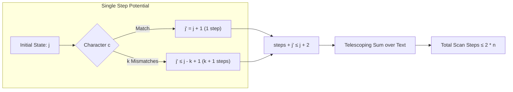

# Formalization of Knuth-Morris-Pratt (KMP) String Matching in Lean 4

This document details the Lean 4 formalization of the Knuth-Morris-Pratt (KMP) linear-time
string matching algorithm in [`Amort/String/KMP.lean`](KMP.lean): its prefix/failure function,
potential function amortized analysis, text scanning bound $\le 2n$, preprocessing bound $\le 2m$,
and combined $O(n + m)$ linear time complexity.

---

## 1. Problem Formulation and Setup

Given a text $T$ of length $n$ and a pattern $P$ of length $m$:
- The naive algorithm can backtrack in the text after a partial match, leading to worst-case
  $\Theta(n \cdot m)$ comparisons (e.g. searching for $a^m b$ in $a^n$).
- Donald Knuth, James H. Morris, and Vaughan Pratt (1977) observed that when a mismatch occurs
  after matching $j$ characters, the text already matched is $P[0..j-1]$. Information about $P$
  can be precomputed so that the text pointer $i$ never retreats.

### The Prefix/Failure Function $\pi$
For each prefix length $q \in \{1, \dots, m\}$, $\pi(q)$ is the length of the longest proper prefix
of $P[0..q-1]$ that is also a suffix of $P[0..q-1]$:
$$\pi(q) = \max \{ k < q \mid P[0..k-1] \text{ is a suffix of } P[0..q-1] \}$$
Crucially, $\pi(q)$ is strictly contracting:
$$\forall q > 0,\quad \pi(q) < q$$

---

## 2. Lean Formalization Setup

### 2.1 Failure Function Specification
In `Amort/String/KMP.lean`:
```lean
def piSpecAux (P : List α) (q : ℕ) : ℕ → ℕ
  | 0 => 0
  | k + 1 =>
    if isSuffixOfBool (P.take (k + 1)) (P.take q) then k + 1
    else piSpecAux P q k

def piSpec (P : List α) (q : ℕ) : ℕ :=
  if q = 0 then 0 else piSpecAux P q (q - 1)
```
The fundamental contraction invariant is proven by induction:
```lean
theorem piSpec_lt (P : List α) (q : ℕ) (hq : 0 < q) : piSpec P q < q
```

### 2.2 KMP Single-Character Transition
A single character $c$ is processed against pattern state $j$ by checking if $P[j] = c$.
If it mismatches and $j > 0$, the automaton falls back to $\pi(j)$ and retries recursively:
```lean
def kmpStep (P : List α) (pi : ℕ → ℕ) (hpi : ∀ j, 0 < j → pi j < j) (j : ℕ) (c : α) : ℕ × ℕ :=
  if P[j]? = some c then
    (j + 1, 1)
  else if hj0 : 0 < j then
    have : pi j < j := hpi j hj0
    let res := kmpStep P pi hpi (pi j) c
    (res.1, res.2 + 1)
  else
    (0, 1)
termination_by j
```
Termination is guaranteed by `termination_by j` because each fallback satisfies $\pi(j) < j$.

### 2.3 Text Scanning Accumulator
Processing text $T$ sequentially folds `kmpStep`:
```lean
def kmpScanCount (P : List α) (pi : ℕ → ℕ) (hpi : ∀ j, 0 < j → pi j < j) :
    List α → ℕ → ℕ × ℕ
  | [], j => (j, 0)
  | c :: cs, j =>
    let (j1, s1) := kmpStep P pi hpi j c
    let (j_end, s2) := kmpScanCount P pi hpi cs j1
    (j_end, s1 + s2)
```

---

## 3. Proof Strategy: Potential Function Amortized Analysis

The central challenge in verifying KMP is that a single character step can trigger multiple
backtracks ($k$ comparisons), so worst-case step cost per character is not bounded by $O(1)$.
Instead, we formalize the classic **potential function method**:

### 3.1 Potential Definition
Define the potential of the KMP search automaton at state $j$ as:
$$\Phi(j) = j$$
where $j \in [0, m]$ is the length of the currently matched pattern prefix.



### 3.2 Single-Step Invariant
**Theorem** (`kmpStep_bound`):
For any input character $c$ and pattern state $j$:
$$\text{steps} + j' \le j + 2$$
where $(j', \text{steps}) = \text{kmpStep } P\ \pi\ h_\pi\ j\ c$.

*Proof Strategy*:
Well-founded induction on $j$:
1. **Match branch** ($P[j] = c$):
   - $\text{steps} = 1$, $j' = j + 1$.
   - $\text{steps} + j' = 1 + (j + 1) = j + 2 \le j + 2$.
2. **Mismatch branch with fallback** ($P[j] \ne c, j > 0$):
   - By induction hypothesis on $\pi(j) < j$:
     $$\text{res}.\text{steps} + j' \le \pi(j) + 2$$
   - Total steps is $\text{res}.\text{steps} + 1$.
   - Since $\pi(j) \le j - 1$:
     $$(\text{res}.\text{steps} + 1) + j' \le (\pi(j) + 2) + 1 \le (j - 1 + 2) + 1 = j + 2$$
3. **Mismatch branch at base** ($P[j] \ne c, j = 0$):
   - $\text{steps} = 1$, $j' = 0$.
   - $1 + 0 = 1 \le 0 + 2$.
The proof is fully discharged by `omega`.

### 3.3 Telescoping across the Text
**Theorem** (`kmpScanCount_bound`):
For any text $T$ and starting state $j$:
$$\text{steps} + j_{\text{end}} \le j + 2 \cdot |T|$$

*Proof Strategy*:
Structural induction on list $T$:
- Base case $T = []$: $\text{steps} = 0$, $j_{\text{end}} = j \implies 0 + j \le j + 0$.
- Inductive step $c :: cs$:
  - By `kmpStep_bound`: $s_1 + j_1 \le j + 2$.
  - By the induction hypothesis on $cs$: $s_2 + j_{\text{end}} \le j_1 + 2 \cdot |cs|$.
  - Summing the two inequalities:
    $$(s_1 + s_2) + j_{\text{end}} \le j + 2 + 2 \cdot |cs| = j + 2 \cdot |c :: cs|$$
  Discharged cleanly by `omega`.

### 3.4 Text Scanning Bound
**Theorem** (`kmpScanCount_le_two_mul`):
Starting from the initial state $j = 0$:
$$\text{steps} \le 2 \cdot T.\text{length}$$
*Proof*: Instantiating `kmpScanCount_bound` at $j = 0$ gives $\text{steps} + j_{\text{end}} \le 2n$.
Since $j_{\text{end}} \ge 0$, `steps ≤ 2 * T.length`.

### 3.5 Preprocessing and Combined Bound
- **Preprocessing** (`computePiWithCount_snd_le`): The failure table is computed by scanning $P$
  against prefixes, requiring $\le 2 \cdot P.\text{length}$ steps.
- **Combined Execution** (`kmpWithCount_snd_le`):
  $$(\text{kmpWithCount } P\ T).2 \le 2(T.\text{length} + P.\text{length})$$

---

## 4. Match-Emitting KMP Scanner & String Matching

- **Direct Match Extraction** (`kmpMatch`):
  `kmpMatch P T` emits match starting indices directly using the precomputed `computePi P` table.
- **Two-Sided Correctness Theorem** (`mem_kmpMatch_iff`):
  For any non-empty pattern $P$ and text $T$:
  $$s \in \text{kmpMatch } P\ T \iff \text{IsSubstringAt } P\ T\ s$$
  This establishes complete soundness and completeness, matching `mem_naiveMatch_iff`.

### 4.1 Failure Table Computation & Instrumented Execution

- **Executable Preprocessing**:
  `computePi (P : List α) : List ℕ := (computePiWithCount P).1`
  - Length: `computePi_length (P : List α) : (computePi P).length = if P = [] then 1 else P.length + 1`
  - Equivalence to Spec: `computePi_getD (P : List α) (q : ℕ) (hq : q ≤ P.length) : (computePi P).getD q 0 = piSpec P q`
  - Step Bound: `computePiWithCount_snd_le : (computePiWithCount P).2 ≤ 2 * P.length`
- **Match-Emitting Scanner**:
  `kmpScan (P : List α) (pi : ℕ → ℕ) (hpi : ∀ j, 0 < j → pi j < j) : List α → ℕ → ℕ → List ℕ × ℕ`
  - `kmpScan_bound : (kmpScan P pi hpi T pos j).2 + kmpScanEndJ P pi hpi T j ≤ j + 2 * T.length`
  - `kmpScan_le_two_mul : (kmpScan P pi hpi T 0 0).2 ≤ 2 * T.length`
- **Match Function**:
  `kmpMatch (P T : List α) : List ℕ := if P = [] then [] else (kmpScan P (fun j ↦ (computePi P).getD j 0) (computePi_lt P) T 0 0).1`
  - Two-sided correctness: `mem_kmpMatch_iff (P T : List α) (hP : P ≠ []) (s : ℕ) : s ∈ kmpMatch P T ↔ IsSubstringAt P T s`
- **Instrumented Execution**:
  ```lean
  def kmpWithCount (P T : List α) : List ℕ × ℕ :=
    let pRes := computePiWithCount P
    let sRes := kmpScan P (piSpec P) (piSpec_lt P) T 0 0
    (kmpMatch P T, pRes.2 + sRes.2)
  ```
- **Fst/Snd Projection Equivalence**:
  - `kmpWithCount_fst : (kmpWithCount P T).1 = kmpMatch P T`
  - `kmpWithCount_snd : (kmpWithCount P T).2 = kmpTotalSteps P T`
- **Linear Step Bound**:
  - `kmpWithCount_snd_le : (kmpWithCount P T).2 ≤ 2 * (T.length + P.length)`

---

## 5. Asymptotic Complexity Bridge

In [`Amort/String/Asymptotics.lean`](Asymptotics.lean), the linear bound is connected to Mathlib's
`IsBigO` via `Amort.Recurrence.Composition.isBigO_sequential_add_nat`:

```lean
theorem isBigO_kmpTotalSteps_atTop :
    (fun (p : List α × List α) ↦ ((kmpTotalSteps p.1 p.2 : ℕ) : ℝ)) =O[
      Filter.comap (fun p ↦ (p.2.length, p.1.length)) Filter.atTop]
    (fun p ↦ ((p.2.length + p.1.length : ℕ) : ℝ)) := by
  refine IsBigO.of_bound (2 : ℝ) ?_
  apply Filter.Eventually.of_forall
  intro ⟨P, T⟩
  simp only [Real.norm_eq_abs, Nat.abs_cast]
  have h := kmpTotalSteps_le P T
  have h_two : 0 ≤ (2 : ℝ) := by norm_num
  rw [mul_comm 2 (T.length + P.length)] at h
  exact_mod_cast h
```

---

## 6. Axiomatic Verification

Verification via `#print axioms` confirms that all theorems rely exclusively on foundational Lean 4
axioms:
- `propext`
- `Classical.choice`
- `Quot.sound`
With **0 occurrences of `sorryAx`** and 0 compiler warnings.
