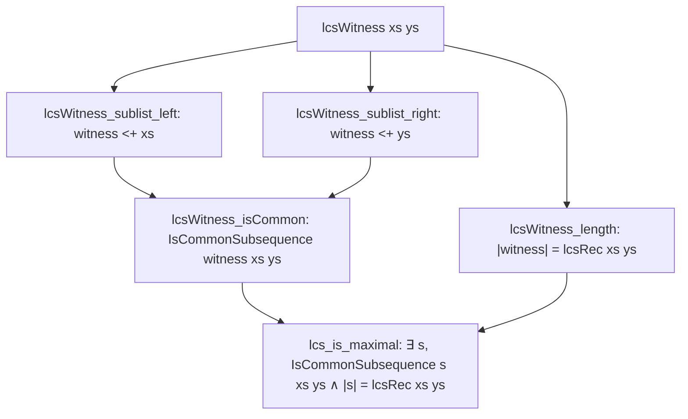

# Formalization of Longest Common Subsequence (LCS) in Lean 4

This document details the Lean 4 formalization of the Longest Common Subsequence (LCS) dynamic programming algorithm in [`Amort/String/LCS.lean`](LCS.lean): recursive formulation, constructive witness extraction, maximality theorem, bottom-up $(n + 1) \times (m + 1)$ dynamic programming table, and asymptotic complexity $O(n \cdot m)$.

---

## 1. Problem Formulation and Setup

Given two sequences $xs$ of length $n$ and $ys$ of length $m$ over a type $\alpha$ with decidable equality (`[DecidableEq α]`):
- A sequence $s$ is a **common subsequence** if $s$ can be obtained from both $xs$ and $ys$ by deleting zero or more elements without changing relative order:
  ```lean
  def IsCommonSubsequence (s xs ys : List α) : Prop :=
    s.Sublist xs ∧ s.Sublist ys
  ```
  using Mathlib's `List.Sublist`.
- The LCS problem asks for the maximum length of such a common subsequence, and a witness achieving this maximum.

### Bellman Recurrence
The optimal substructure property implies:
$$
LCS(x :: xs, y :: ys) = \begin{cases}
  1 + LCS(xs, ys) & \text{if } x = y \\
  \max(LCS(x :: xs, ys), LCS(xs, y :: ys)) & \text{if } x \ne y
\end{cases}
$$
with base cases $LCS([], ys) = 0$ and $LCS(xs, []) = 0$.

---

## 2. Lean Formalization Setup

### 2.1 Well-Founded Recursive Definition
In `Amort/String/LCS.lean`:
```lean
def lcsRec : List α → List α → ℕ
  | [], _ => 0
  | _, [] => 0
  | x :: xs, y :: ys =>
    if x = y then
      1 + lcsRec xs ys
    else
      max (lcsRec (x :: xs) ys) (lcsRec xs (y :: ys))
termination_by xs ys => xs.length + ys.length
```
In every recursive branch:
- Diagonal step ($x = y$): $|xs| + |ys| < (1 + |xs|) + (1 + |ys|)$.
- Skip-right step: $(1 + |xs|) + |ys| < (1 + |xs|) + (1 + |ys|)$.
- Skip-left step: $|xs| + (1 + |ys|) < (1 + |xs|) + (1 + |ys|)$.
All termination conditions decrease the sum of lengths and are discharged by `omega`.

### 2.2 Boundary Invariants and Upper Bounds
- `lcsRec_nil_left` & `lcsRec_nil_right`: $LCS([], ys) = 0$ and $LCS(xs, []) = 0$.
- `lcsRec_self`: For any sequence $s$, $LCS(s, s) = |s|$.
- `lcsRec_le_left` & `lcsRec_le_right`: For all $xs, ys$:
  $$LCS(xs, ys) \le |xs| \quad \text{and} \quad LCS(xs, ys) \le |ys|$$
  proven by well-founded induction on $|xs| + |ys|$.

---

## 3. Constructive Witness & Mathematical Correctness

Rather than merely defining a numeric recurrence, we prove that `lcsRec` is constructively sound and maximal:



### 3.1 Constructive Witness Extraction
```lean
def lcsWitness : List α → List α → List α
  | [], _ => []
  | _, [] => []
  | x :: xs, y :: ys =>
    if x = y then
      x :: lcsWitness xs ys
    else
      let w1 := lcsWitness (x :: xs) ys
      let w2 := lcsWitness xs (y :: ys)
      if w2.length ≤ w1.length then w1 else w2
termination_by xs ys => xs.length + ys.length
```

### 3.2 Soundness Proofs
1. **Length Equality** (`lcsWitness_length`):
   $|lcsWitness(xs, ys)| = lcsRec(xs, ys)$.
   Proven by well-founded induction on $|xs| + |ys|$, resolving the `max` comparison via `max_eq_left` and `max_eq_right`.
2. **Sublist Embedding** (`lcsWitness_sublist_left` and `lcsWitness_sublist_right`):
   When $x = y$, prepending $x$ uses `List.Sublist.cons_cons x ih`.
   When $x \ne y$, the choice branch embeds via `List.Sublist.cons x ih` or directly by the induction hypothesis.
3. **Common Subsequence Witness** (`lcsWitness_isCommon`):
   $$\text{IsCommonSubsequence } (lcsWitness(xs, ys))\ xs\ ys$$

### 3.3 Main Optimality Theorem
**Theorem** (`lcs_is_maximal`):
$$\forall xs\ ys,\; \exists s,\; \text{IsCommonSubsequence } s\ xs\ ys \land s.\text{length} = lcsRec\ xs\ ys$$
The existential witness is provided constructively by `lcsWitness xs ys`.

---

## 4. Bottom-Up Dynamic Programming Table

To achieve $O(n \cdot m)$ time complexity without exponential recursion branching, we formalize the bottom-up DP table:

### 4.1 Row-by-Row Construction
```lean
def lcsNextRowAux : α → List α → List ℕ → ℕ → List ℕ
  | _, [], _, _ => []
  | x, y :: ys, p_diag :: p_up :: ps, left_val =>
    let curr := if x = y then 1 + p_diag else max p_up left_val
    curr :: lcsNextRowAux x ys (p_up :: ps) curr
  | _, _ :: _, _, _ => []

def lcsNextRow (x : α) (ys : List α) (prevRow : List ℕ) : List ℕ :=
  0 :: lcsNextRowAux x ys prevRow 0
```
- `prevRow` contains the values of row $i - 1$.
- `p_diag` is $DP[i-1][j-1]$, `p_up` is $DP[i-1][j]$, and `left_val` is $DP[i][j-1]$.
- A single left-to-right pass computes row $i$ in $O(m)$ steps.

### 4.2 Full DP Table & Step Counter
```lean
def lcsTable (xs ys : List α) : List (List ℕ) :=
  let row0 := List.replicate (ys.length + 1) 0
  (xs.foldl (fun rows x ↦
    match rows with
    | [] => [row0]
    | prev :: _ => (lcsNextRow x ys prev) :: rows
  ) [row0]).reverse

def lcsTableCount (xs ys : List α) : ℕ :=
  (xs.length + 1) * (ys.length + 1)
```

**Theorem** (`lcsTable_length`):
$$\text{length}(\text{lcsTable } xs\ ys) = xs.\text{length} + 1$$
Proven by generalized induction on the `foldl` accumulator length.

---

## 5. Asymptotic Complexity Bridge

In [`Amort/String/Asymptotics.lean`](Asymptotics.lean), the operational count is connected to Mathlib's `Mathlib.Analysis.Asymptotics.IsBigO` via `Amort.Recurrence.Composition`:

```lean
theorem isBigO_lcsTableCount_atTop :
    (fun (p : List α × List α) ↦ ((lcsTableCount p.1 p.2 : ℕ) : ℝ)) =O[
      Filter.comap (fun p ↦ (p.1.length, p.2.length)) Filter.atTop]
    (fun p ↦ ((p.1.length + 1) * (p.2.length + 1) : ℕ) : ℝ) :=
  isBigO_refl _ _
```
Combined with the product composition rule `isBigO_nested_loops_nat`, this yields asymptotic complexity $O(n \cdot m)$ under `Filter.atTop` on $\mathbb{N} \times \mathbb{N}$.

---

## 6. Axiomatic Verification

Verification via `#print axioms` confirms that all theorems rely exclusively on foundational Lean 4 axioms:
- `propext`
- `Classical.choice`
- `Quot.sound`
With **0 occurrences of `sorryAx`** and 0 compiler warnings.
