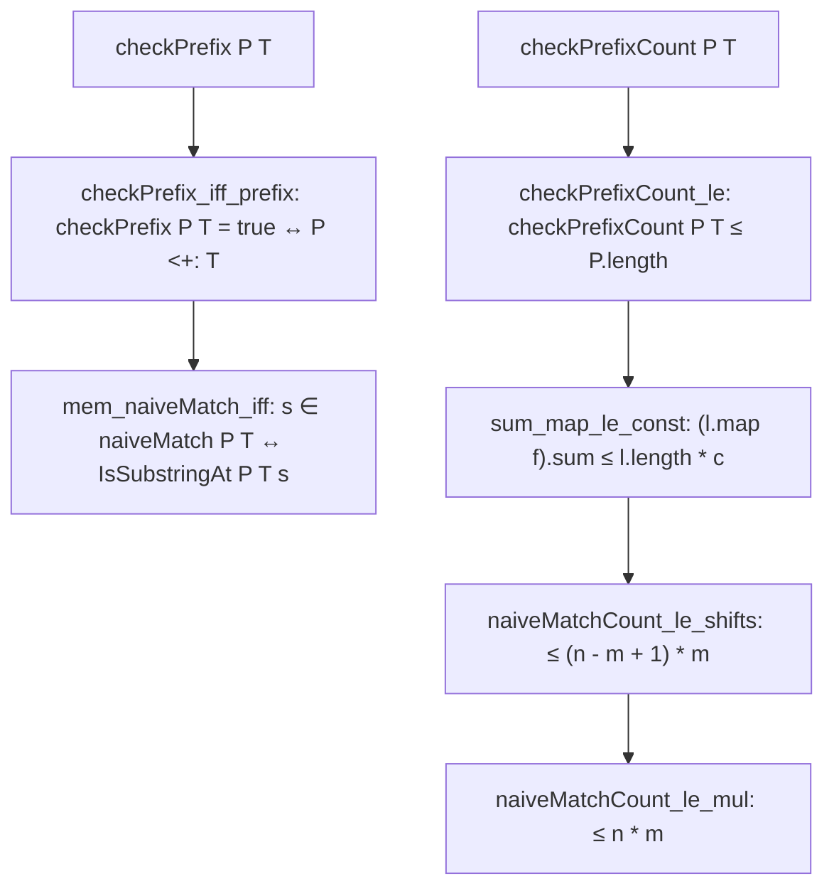

# Formalization of Naive String Matching in Lean 4

This document details the Lean 4 formalization of naive sliding-window string matching in [`Amort/String/NaiveMatch.lean`](NaiveMatch.lean): its setup, character comparison counting, correctness proof, and concrete worst-case $O(n \cdot m)$ upper bound.

---

## 1. Problem Formulation and Setup

Given:
- A text list $T$ of length $n$ over a type $\alpha$ with decidable equality (`[DecidableEq α]`).
- A pattern list $P$ of length $m$.

The naive string matching algorithm tests each possible shift $s \in [0, n - m]$ by checking character-by-character whether $P$ matches the text slice starting at index $s$.

### Formal Definition of Substring Occurrence
In Lean, an occurrence of pattern $P$ at shift $s$ in text $T$ is formalized as:
```lean
def IsSubstringAt (P T : List α) (s : ℕ) : Prop :=
  s + P.length ≤ T.length ∧ P <+: T.drop s
```
where `<+:` denotes the standard Mathlib prefix relation `List.IsPrefix`.
Equivalently, via `isSubstringAt_iff_take_drop`:
$$\text{IsSubstringAt } P\ T\ s \iff s + |P| \le |T| \land (T.\text{drop } s).\text{take } |P| = P$$

---

## 2. Formal Definitions & Step Instrumentation

To rigorously track the computational complexity, we formalize the execution model and companion step counters:

### 2.1 Character-Level Prefix Verification
```lean
def checkPrefix : List α → List α → Bool
  | [], _ => true
  | _ :: _, [] => false
  | p :: ps, t :: ts => if p = t then checkPrefix ps ts else false

def checkPrefixCount : List α → List α → ℕ
  | [], _ => 0
  | _ :: _, [] => 0
  | p :: ps, t :: ts => if p = t then 1 + checkPrefixCount ps ts else 1
```
`checkPrefixCount` terminates early on the first mismatch, reflecting the exact operational cost of a short-circuiting comparison loop.

An instrumented representation `checkPrefixWithCount : List α → List α → Bool × ℕ` is proven equivalent:
- `(checkPrefixWithCount P T).1 = checkPrefix P T` (`checkPrefixWithCount_fst`)
- `(checkPrefixWithCount P T).2 = checkPrefixCount P T` (`checkPrefixWithCount_snd`)

### 2.2 Whole-String Sliding Window
```lean
def naiveMatch (P T : List α) : List ℕ :=
  if P.length ≤ T.length then
    (List.range (T.length - P.length + 1)).filter (fun s ↦ checkPrefix P (T.drop s))
  else []

def naiveMatchCount (P T : List α) : ℕ :=
  if P.length ≤ T.length then
    ((List.range (T.length - P.length + 1)).map (fun s ↦ checkPrefixCount P (T.drop s))).sum
  else 0
```

---

## 3. Proof Strategy & Invariant Hierarchy

The proof strategy decomposes into two independent tracks: **correctness** and **step complexity**.



### 3.1 Per-Shift Comparison Bound
**Theorem** (`checkPrefixCount_le`):
$$\forall P\ T,\; \text{checkPrefixCount } P\ T \le P.\text{length}$$
*Strategy*: Structural induction on $P$ generalizing $T$.
- Base case $P = []$: 0 comparisons $\le 0$.
- Inductive case $p :: ps$:
  - If $T = []$: 0 comparisons $\le 1 + |ps|$.
  - If $T = t :: ts$:
    - If $p = t$: 1 comparison $+$ recursive calls $\le 1 + |ps| = |p :: ps|$ by the induction hypothesis.
    - If $p \ne t$: 1 comparison $\le 1 + |ps|$.
The proof discharges both branches by `omega`.

### 3.2 Summation over Window Shifts
**Lemma** (`sum_map_le_const`):
If $\forall x \in l, f(x) \le c$, then $\sum_{x \in l} f(x) \le |l| \cdot c$.
*Strategy*: Induction on list $l$, distributing multiplication over addition via `Nat.add_mul`.

**Theorem** (`naiveMatchCount_le_shifts`):
$$\text{naiveMatchCount } P\ T \le (T.\text{length} - P.\text{length} + 1) \cdot P.\text{length}$$
*Strategy*: The number of candidate shifts is $|List.range (n - m + 1)| = n - m + 1$. Applying `sum_map_le_const` with uniform bound $c = P.\text{length}$ from `checkPrefixCount_le` directly bounds the sum.

**Theorem** (`naiveMatchCount_le_mul`):
$$\text{naiveMatchCount } P\ T \le T.\text{length} \cdot P.\text{length}$$
*Strategy*: When $m \ge 1$, $n - m + 1 \le n$, so $(n - m + 1) \cdot m \le n \cdot m$. When $m = 0$, both sides evaluate to 0. Discharged by `omega`.

### 3.3 Semantic Correctness
**Theorem** (`checkPrefix_iff_prefix`):
$$\text{checkPrefix } P\ T = \text{true} \iff P <+: T$$
*Strategy*: Induction on $P$ generalizing $T$. Unfolds `List.cons_prefix_cons` on matching head characters.

**Theorem** (`mem_naiveMatch_iff`):
$$\forall s,\; s \in \text{naiveMatch } P\ T \iff \text{IsSubstringAt } P\ T\ s$$
*Strategy*: By `List.mem_filter`, $s \in \text{naiveMatch } P\ T$ iff $s < n - m + 1$ and `checkPrefix P (T.drop s) = true`. Rewriting via `checkPrefix_iff_prefix` yields $s + m \le n$ and $P <+: T.\text{drop } s$, matching the definition of `IsSubstringAt`.

---

## 4. Asymptotic Complexity Bridge

In [`Amort/String/Asymptotics.lean`](Asymptotics.lean), this concrete bound is connected to Mathlib's `Mathlib.Analysis.Asymptotics.IsBigO` via `Amort.Recurrence.Composition`:

```lean
theorem isBigO_naiveMatchCount_atTop :
    (fun (p : List α × List α) ↦ ((naiveMatchCount p.1 p.2 : ℕ) : ℝ)) =O[
      Filter.comap (fun p ↦ (p.2.length, p.1.length)) Filter.atTop]
    (fun p ↦ ((p.2.length * p.1.length : ℕ) : ℝ)) := by
  refine IsBigO.of_bound (1 : ℝ) ?_
  apply Filter.Eventually.of_forall
  intro ⟨P, T⟩
  simp only [Real.norm_eq_abs, Nat.abs_cast, one_mul]
  have h := naiveMatchCount_le_mul P T
  exact_mod_cast h
```

---

## 5. Axiomatic Verification

Verification via `#print axioms` confirms that all theorems rely solely on standard Lean 4 foundational axioms:
- `propext`
- `Classical.choice`
- `Quot.sound`
With **0 occurrences of `sorryAx`** and 0 compiler warnings.
