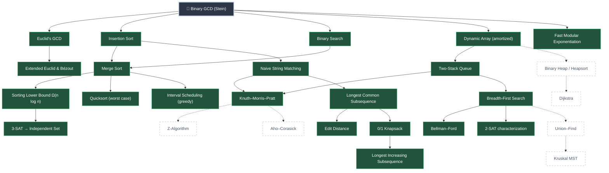

# Verified Algorithms Skill Tree: Tutorial Proposal (v2)

> **Pitch:** *When AI writes the code, understanding becomes the job.*
> Agents will increasingly tell us "this algorithm is correct" and "this runs in O(n log n)".
> The right response to a plausible claim is: **prove it.** In practice, the proof will come back
> as Lean. Lean checks every proof mechanically, so the proof takes care of itself. What Lean
> cannot check is whether the theorem says what we meant.
>
> **The division of labour:** *you own the statement, the AI writes the proof, Lean referees.*
> This tutorial teaches the part that stays human: understanding algorithms well enough to write,
> read and judge their formal statements.

---

## 1. Why this tutorial, why now

### 1.1 The problem: plausible claims are cheap
AI can generate an implementation, a docstring saying "proven correct", and a proof that compiles,
all in seconds. The proof is the part we no longer need to worry about: if Lean accepts it, it is
valid. But a valid proof only establishes *some* theorem. Whether it is the theorem you care about
depends entirely on its **statement**, and checking that takes a human who understands both the
algorithm and the notation.

### 1.2 A true story from this repository
This repo is the motivating example. An AI agent produced 97 Lean modules covering the algorithms
canon. Every one compiled: **0 `sorry`, 0 axioms, a green build.** Every proof was valid. A review
of the *statements* ([`proof_review.md`](proof_review.md)) found that about 40% of them proved
nothing meaningful. For example:

- a "KMP correctness" theorem that was really about the naive matcher (`kmpMatch := naiveMatch`);
- a "linear-time Ukkonen" theorem whose content was `4 * n ≤ 4 * n`;
- a shortest-path "spec" that the all-zero distance function satisfies;
- an "inverse Ackermann" function that was a lookup table capped at 5.

Later fix passes produced subtler fakes that still matched the requested theorem names: a spec
renamed to look like the algorithm, a property *defined* as the check that was supposed to detect
it, and a step counter that skipped repeated work. None of these were proof errors. Lean was right
every time. Every one was a **statement** error, and every one was caught the same way: by reading
the Lean definitions and theorem statements and asking what they actually promise.

That is the skill this tutorial teaches. The verified modules that survived the review are its
reference material.

### 1.3 Who it is for
- **Prerequisite:** comfortable in *one* programming language (any: Python, JavaScript, C++, …).
- **Not expected:** writing proofs. Learners don't need to know tactics or how to finish a proof.
  When they want a proof, they ask an AI, and Lean checks the result.
- **Expected by the end:** reading a Lean definition as fluently as code; knowing what a correct
  spec and a correct theorem look like for a given problem; and spotting when a statement is weaker
  than its claim.
- **First learner:** the author, who works through every node before it is published.

---

## 2. The shape of every module

Every node follows the same five steps. For each step, the learner's job is to understand the Lean
**setup**: definitions and statements. Proofs are provided, and they are optional reading.

| # | Step | The question it answers | What the learner reads and understands |
| :-: | :--- | :--- | :--- |
| 1 | **Define the problem** | What are the inputs, and what counts as a right answer? | Plain-language statement, examples, edge cases. |
| 2 | **Formalize the definition** | Can we state "right answer" precisely, *without* mentioning any algorithm? | The spec, e.g. `Nat.gcd`, `IsSubstringAt P T s`, `List.Pairwise (· ≤ ·)`: what it includes, what it rules out, and which edge cases it decides. |
| 3 | **Understand the algorithm** | How does it work, why is it faster, and why does it stop? | The executable `def`, run on examples with `#eval`, and its termination argument (`termination_by`): why the recursion must end. |
| 4 | **State correctness** | What exactly would "correct" mean, and is this theorem that? | `theorem algo_correct : … algo x … ↔ Spec x`. Why both directions are needed (nothing missed, nothing wrong), and which hypotheses are allowed (sorted input: yes; "assume the answer is right": no). |
| 5 | **State the time complexity** | What is being counted, and is the count honest? | The instrumented `algoWithCount`: why `.1 = algo x` ties the count to the real algorithm, what one "step" is, and why `.2 ≤ bound` is the real claim, rather than a `bound` *defined* as the answer. |

**Proofs are optional reading.** Each theorem comes with a short plain-language proof idea (for
example, "the remainder at least halves every two steps"). The Lean proof is there for the
curious. It is never on the critical path, because Lean has already checked it.

**Honest cost models.** Step 5 always says what is being counted (comparisons, recursive calls,
cell fills, relaxations) and says plainly that this is an abstract operation count, not wall-clock
time.

### 2.1 The exercises: statement work, not proof work

| Exercise | What the learner does | What it trains |
| :--- | :--- | :--- |
| **Predict** | Say what `#eval algo …` returns, then run it. | Reading Lean as code. |
| **State it yourself** | Given the problem in English, write the spec or theorem statement, then compare with the reference. The check is `example : YourStatement ↔ ReferenceStatement`, or simply a discussion when they differ. | Formalizing. |
| **Spot the fake** | Given 3–4 statements, some flawed in the ways §1.2 describes, decide which ones actually prove the claim, and why. | Auditing an agent's claim, which is the pitch in practice. |
| **Prove it with AI** (optional) | Hand your statement to an AI assistant and ask for a Lean proof. Lean accepts or rejects it. If the AI "fixes" the statement to make it provable, notice that and reject it. | The real-world workflow: human statement, machine proof, Lean as referee. |

---

## 3. Before you start: a first look at Lean

Learners need to *read* Lean, not prove in it, so the prerequisite is light:

| Resource | Why | Time |
| :--- | :--- | :--- |
| **[*Functional Programming in Lean*](https://lean-lang.org/functional_programming_in_lean/), ch. 1** (recommended) | Lean as a programming language: `def`, pattern matching, structures, `#eval`. This is enough to read every algorithm in the tree. | 2–3 hours |
| [Natural Number Game](https://adam.math.hhu.de/#/g/leanprover-community/nng4) (optional) | Runs in the browser. Gives a feel for what a proof *is*, which helps with judging statements, but is not required. | 3–6 hours |
| [*Theorem Proving in Lean 4*](https://lean-lang.org/theorem_proving_in_lean4/) | Reference for the curious. | — |

The tutorial teaches the rest of the notation (`∀`, `∃`, `↔`, `Prop` vs `Bool`, `List.Perm`, …) as it
appears, node by node. To run `#eval` and check statements, learners install Lean locally (elan +
VS Code), because the modules depend on Mathlib.

---

## 4. The skill tree

### 4.1 How the tree works
- **Binary GCD is the opening node.** Everyone starts there.
- **Finishing a node unlocks the nodes after it.** Binary GCD unlocks five nodes, and each later
  node unlocks one to three more.
- **Each node teaches two skills: one algorithmic, one Lean-reading.** The reading skill is what
  makes the next nodes reachable. For example, Insertion Sort is where `List.Perm` and
  `List.Pairwise` first appear, so every list-based node depends on it.
- **The tree only contains verified nodes.** A node enters the tree only when its reference
  module passes the Definition of Done in [`proof_review.md` §2](proof_review.md). Planned nodes
  are shown dashed.

### 4.2 The tree (current verified reference in solid boxes)



### 4.3 Node catalogue: what each node teaches

| Node | Algorithm skill | Lean reading skill introduced | Unlocks |
| :--- | :--- | :--- | :--- |
| **Binary GCD** 🌱 | Bit tricks (parity, halving); one spec, a non-obvious algorithm | `def`, `if`/`else`, `#eval`, `theorem` as a claim, `termination_by` (why recursion ends), "equals the reference" (`= Nat.gcd a b`), the `WithSteps` counting pattern, `Nat.size` as bit length | Euclid, Insertion Sort, Binary Search, Dynamic Array, Modular Exponentiation |
| Euclid's GCD | Remainders; comparing two algorithms against one spec | Two implementations proved equal to the same spec; `min` in a bound | Extended Euclid |
| Extended Euclid | Certificates (Bézout coefficients) | `ℤ` vs `ℕ`, casts, results as tuples | — |
| Modular Exponentiation | Halving the exponent | Modular arithmetic (`% m`, `Nat.ModEq`), hypotheses like `1 < m` | — |
| Insertion Sort | The sorting spec: sorted **and** a permutation | `List`, `List.Perm` (`~`), `List.Pairwise`; why "sorted" alone is a fake spec (the empty list is sorted) | Merge Sort, Naive Matching |
| Binary Search | Invariants on sorted input; returning an index | `Option`, `xs[i]?`, preconditions as hypotheses (`xs.Pairwise (· ≤ ·) →`), `↔` statements | Merge Sort |
| Dynamic Array | Amortized analysis with a potential function | `structure`, integer potentials, "total cost of k operations ≤ 3k" | Two-Stack Queue, (Heap) |
| Merge Sort | Divide and conquer; the `T(n) = 2T(n/2) + n` recurrence | Recurrences as statements; `n * Nat.size n` as n log n | Lower Bound, Quicksort, Interval Scheduling |
| Sorting Lower Bound | Proving *no* algorithm can do better | Inductive trees, `Equiv.Perm`, factorial; first `IsBigO`/`IsTheta` | 3-SAT → IS |
| Quicksort | Worst case, and showing a bound is **tight** | Worst-case attainment theorems (`= n(n−1)/2` on a specific input) | — |
| Interval Scheduling | Greedy choice | Optimality statements: "for every alternative solution `S`, `S.length ≤ …`" | — |
| Two-Stack Queue | Amortized cost over operation sequences | Specifying behaviour via an abstract model (`toList`) | KMP, BFS |
| Naive Matching | Specifying a search problem | Specs as `Prop` (`IsSubstringAt`); sound **and** complete as one `↔` | KMP, LCS |
| KMP | The failure function; never re-reading the text | One function carrying both a correctness theorem and a linear-cost theorem; why they must be about the *same* function | (Z, Aho–Corasick) |
| LCS | Optimal substructure; memo tables | Optimisation specs: "achievable" **and** "nothing better"; "table = recursion" statements | Edit Distance, Knapsack |
| Edit Distance | Alignments as explicit objects | Inductive predicates (`IsAlignment`) | — |
| 0/1 Knapsack | Subset choice via DP | `Finset`, sums over subsets | LIS |
| LIS | DP over prefixes | Subsequences (`List.Sublist`) | — |
| BFS | Shortest paths in unweighted graphs | Graphs as adjacency functions, reachability; **algorithm = spec** (`bfsWithCount … = bfsDist …`); why a spec satisfied by the all-zero function is a fake | Bellman–Ford, 2-SAT, (Union–Find) |
| Bellman–Ford | Negative weights; detecting negative cycles | `WithTop ℤ` (∞ as ⊤); why "negative cycle" must be defined as a cycle, not as the check that detects it | — |
| 2-SAT | Implication graphs | Characterisation theorems (satisfiable ↔ graph property) | — |
| 3-SAT → Independent Set | Reductions between problems | A constructed object plus an `↔` connecting two problems | — |

### 4.4 Suggested paths
Learners choose their route after Binary GCD. Four suggested paths:

| Path | Route | Theme |
| :--- | :--- | :--- |
| **Sorting & searching** | Binary GCD → Insertion Sort → Binary Search → Merge Sort → Lower Bound → Quicksort | Specs, recurrences, and optimality. |
| **Amortization** | Binary GCD → Dynamic Array → Two-Stack Queue → Naive Matching → KMP | Potential functions and what "amortized" really means. |
| **Dynamic programming** | Binary GCD → Insertion Sort → Naive Matching → LCS → Edit Distance → Knapsack → LIS | Optimal substructure and "table = recursion". |
| **Graphs & hardness** | Binary GCD → Dynamic Array → Two-Stack Queue → BFS → Bellman–Ford / 2-SAT → Lower Bound → 3-SAT → IS | Algorithms on graphs, then what cannot be done fast. |

---

## 5. The opening node in detail: Binary GCD

Binary GCD is the opener because programmers already know its moves: `x % 2`, `x / 2`,
subtraction. The whole method fits in one small function, with no data structures to learn at
the same time.

1. **Define:** given `a b : ℕ`, find the largest `d` dividing both. Edge cases: `gcd 0 b = b`, and
   `gcd 0 0 = 0` by convention.
2. **Formalize:** the spec is Mathlib's `Nat.gcd`. The learner reads its characterising
   statements (`Nat.gcd_dvd_left`, `Nat.gcd_dvd_right`, `Nat.dvd_gcd`) and sees that together they
   say "a common divisor, and every common divisor divides it". That is exactly the plain-language
   definition.
3. **Understand:**
   ```lean
   def binaryGcd (a b : ℕ) : ℕ :=
     if a = 0 then b
     else if b = 0 then a
     else if a % 2 = 0 ∧ b % 2 = 0 then 2 * binaryGcd (a / 2) (b / 2)  -- both even
     else if a % 2 = 0 then binaryGcd (a / 2) b                        -- only a even
     else if b % 2 = 0 then binaryGcd a (b / 2)                        -- only b even
     else if b ≤ a then binaryGcd ((a - b) / 2) b                      -- both odd
     else binaryGcd a ((b - a) / 2)
   termination_by a + b
   ```
   (Simplified from [`Amort/GCD/BinaryGCD.lean`](Amort/GCD/BinaryGCD.lean).) `#eval binaryGcd 48 18`
   returns `6`. The first Lean lesson: `termination_by a + b` is a promise that every recursive call
   makes `a + b` smaller. Check each branch by hand. Why does `a = 0` need its own case?
4. **State correctness:**
   ```lean
   theorem binaryGcd_eq_gcd (a b : ℕ) : binaryGcd a b = Nat.gcd a b
   ```
   Read it as: *for every* `a` and `b`, with no preconditions, the algorithm returns the true gcd.
   Proof idea (optional): each branch preserves the gcd. For example, if `a` is even and `b` is odd,
   then `gcd a b = gcd (a/2) b`.
5. **State the complexity:**
   ```lean
   theorem binaryGcdWithSteps_fst (a b : ℕ) : (binaryGcdWithSteps a b).1 = binaryGcd a b
   theorem binaryGcdSteps_le_size_add_size (a b : ℕ) :
       binaryGcdSteps a b ≤ Nat.size a + Nat.size b
   ```
   The first theorem ties the counter to the real algorithm. The second says the number of
   recursive calls is at most the total number of *bits* in the inputs. Proof idea (optional):
   every step shrinks at least one argument by at least one bit.
6. **Spot the fake:** which of these is a genuine complexity result?
   (a) `def gcdCost (a b : ℕ) := Nat.size a + Nat.size b` together with `gcdCost a b ≤ Nat.size a + Nat.size b`;
   (b) the two theorems in step 5;
   (c) `binaryGcdSteps a b ≤ a + b`.
   (Answer: (b) is the real result. (a) defines the cost as its own answer, so it says nothing about
   the algorithm. (c) is true and tied to the algorithm, but linear in the *values*, which is
   exponential in the bits.)
7. **Prove it with AI (optional):** write the statement "binary GCD of `2a` and `2b` is twice binary
   GCD of `a` and `b`", ask an assistant for a Lean proof, and let Lean check it.

Reference: [`Amort/GCD/BinaryGCD.lean`](Amort/GCD/BinaryGCD.lean) and
[`Amort/GCD/StepCount.lean`](Amort/GCD/StepCount.lean).

---

## 6. Format and mechanics

### 6.1 What a learner works with
Each node has two parts:
- **Chapter** (`tutorial/<node>.md`): the five steps in prose, with every definition and statement
  shown next to its plain-language reading, the proof ideas in words, and the exercises from §2.1.
- **Lean file** (`Tutorial/<Node>.lean`): the definitions and theorem statements, importing the
  verified proofs from `Amort/`. Learners run `#eval`, write their own `example` statements, and
  can ask an AI to prove them. Every check is Lean's, never the learner's own judgement about a
  proof.

### 6.2 Keeping it honest
- Only modules that pass [`proof_review.md` §2](proof_review.md) enter the tree. The chapters
  quote the reference theorems verbatim, so what the text says and what Lean checks cannot drift
  apart.
- A CI check confirms that every statement quoted in a chapter still type-checks against the reference.
- "Spot the fake" examples are compiled too. A fake is a *true, provable* theorem that is weaker
  than its claim, which is the realistic failure mode, so each fake is shown with its (valid) proof.

### 6.3 Delivery
- **v1:** Markdown chapters in the repo, plus a static rendering of the skill tree. No build step
  beyond `lake build`.
- **Later:** an mdBook or [Verso](https://github.com/leanprover/verso) site with a clickable tree
  and local progress tracking.

---

## 7. Roadmap

| Phase | Deliverable | Done when |
| :--- | :--- | :--- |
| **0. Preface** | §1 as a standalone essay: *"When AI writes the code, understanding becomes the job"*. | The pitch can be delivered in two minutes. |
| **1. Pilot** | Binary GCD plus its five unlocks (Euclid, Insertion Sort, Binary Search, Dynamic Array, Modular Exponentiation), each with a chapter, Lean file and all four exercise types. | One outside reader (a programmer new to Lean) finishes the pilot and can explain every headline statement, and catch every fake, without help. |
| **2. First branches** | Extended Euclid, Merge Sort, Lower Bound, Two-Stack Queue, Naive Matching, KMP, LCS, BFS. | Same test, with feedback from the pilot applied. |
| **3. Full verified tree** | The remaining solid nodes in §4.2, plus the four paths. | Every solid node has a chapter and a Lean file. |
| **4. Grow the tree** | Planned nodes join as their reference modules pass review (Heap, Union–Find, Dijkstra, Kruskal, Z, Aho–Corasick, …). | Driven by [`proof_review.md` §9](proof_review.md). |

---

## 8. Open questions
1. **How much proof to show:** proof ideas in words only, or also a guided walk through one Lean
   proof (e.g. in the Binary GCD node) so readers see what a proof *is* once?
2. **Asymptotics:** introduce Mathlib's `IsBigO` (and filters) once, at the Lower Bound node, or keep
   every complexity claim as an explicit inequality such as `≤ Nat.size a + Nat.size b`?
3. **"Spot the fake" sources:** hand-written, or curated from the real AI failures recorded in
   `proof_review.md` (more authentic, and they support the pitch)?
4. **The AI-proof exercise:** recommend a specific assistant or workflow, or stay tool-neutral?
5. **Audience check:** is "one programming language + FPIL ch. 1" enough to read the Binary GCD node?
   The pilot's outside reader should settle this.

---

*v1 of this plan (four "verification disciplines", a full aspirational tree of about 60 nodes, learners
writing proofs) was written before the proof review. v2 keeps only verified nodes, opens with
Binary GCD, makes learners responsible for statements rather than proofs, adds the reading
exercises, and puts the AI-era pitch first.*
